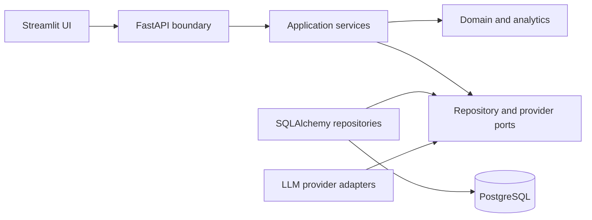

# ADR-0001: Adopt a Modular Monolith as the Baseline Architecture

## Status

Accepted

## Date

2026-08-23

## Decision owners

RunCoach AI project team

## Context

RunCoach AI must ingest heterogeneous activity exports, normalize and deduplicate records, calculate
deterministic training indicators, evaluate predictive models, orchestrate controlled coaching
recommendations, expose an API, and support an analytical user interface.

These capabilities have distinct domain responsibilities, but they also share:

- One canonical athlete and activity model.
- Transactional import and provenance requirements.
- Versioned analytical contracts.
- A common privacy boundary.
- A single release lifecycle.
- A small initial runtime topology.

The architecture must remain understandable, testable, deployable, and open to evolution when
measured requirements change. It must not create distribution complexity merely to display several
technology names.

## Decision drivers

- Strong data integrity across import, canonicalization, and derived records.
- Explicit separation of domain responsibilities.
- Reproducible local and cloud deployment.
- Efficient development and debugging.
- Low operational coupling to external infrastructure.
- Ability to run without an LLM provider.
- Clear future extraction paths.
- Auditability from source activity to coaching recommendation.
- Requirements based on observed scale rather than assumed scale.

## Decision

RunCoach AI will use a modular monolith as its baseline application architecture.

One Python codebase will contain explicit modules for:

- Configuration and shared kernel.
- Athlete profiles and goals.
- Import orchestration.
- Source-format adapters.
- Validation and data quality.
- Canonical activities and provenance.
- Deterministic analytics.
- Race readiness.
- Machine-learning datasets, experiments, and predictions.
- Coaching workflow and provider abstraction.
- Persistence.
- REST API.
- Streamlit UI integration.

The modules share a PostgreSQL database but do not bypass each other's published domain contracts.
SQLAlchemy models and repositories belong to the persistence boundary; domain services own business
rules and deterministic calculations.

The application may run more than one process where the runtime responsibility differs. The API,
Streamlit UI, migration command, and a future background import process may use separate startup
commands while remaining part of the same versioned application.

## Structural rules

### Module ownership

Each module must define:

- Its inputs and outputs.
- Its domain rules.
- Its persistence interface.
- Its error vocabulary.
- Its tests.
- The events or service contracts through which another module interacts with it.

### Dependency direction

Domain calculations must not depend on FastAPI, Streamlit, an LLM SDK, or a concrete cloud service.

Preferred dependency direction:

Infrastructure adapters depend on domain-defined ports. The domain does not import infrastructure
implementations.

### Database ownership

PostgreSQL is the durable system of record. Modules may share one database instance, but schema
objects have documented ownership. Cross-module updates occur through application services rather
than UI code or arbitrary SQL.

Alembic is the only schema-evolution mechanism.

### Process boundaries

Separate processes are permitted when they provide an operational benefit:

- API process for request handling.
- Streamlit process for the analytical interface.
- One-off migration process.
- Background import process if measured import latency requires asynchronous execution.

Separate processes do not automatically imply separate domain services or independent databases.

### Internal events

Application events may be represented as typed in-process messages or persisted job state. Their
contracts should be designed so that a broker-backed implementation can be introduced without
changing domain semantics.

## Runtime topology

The baseline runtime consists of:

- A FastAPI container.
- A PostgreSQL service.
- A Streamlit container when the UI is enabled.
- One-off Alembic commands.

The local environment uses Docker Compose. The cloud environment uses a managed container platform
and managed PostgreSQL with sanitized or synthetic data.

## Options considered

### Option A: Unstructured single application

One application with no enforced domain modules would minimize initial files and interfaces.

Rejected because:

- Import, analytics, ML, and coaching rules would become tightly coupled.
- Deterministic and generative responsibilities would be harder to audit.
- Tests would depend on broad application state.
- Later extraction would require discovering boundaries after implementation.

### Option B: Modular monolith

One deployable application with explicit domain modules and internal contracts.

Selected because it provides strong boundaries, transactional consistency, and low operational
overhead while retaining clear evolution paths.

### Option C: Independently deployed microservices

Separate services for ingestion, analytics, prediction, coaching, and identity.

Not selected as the baseline because current requirements do not require independent ownership,
release cadence, scaling, fault isolation, or data sovereignty for these domains. The option remains
valid when those conditions emerge.

### Option D: Event-streaming platform as the integration core

Kafka or a compatible broker could provide replayable events and independent consumers.

Not selected as the baseline because current ingestion is bounded and batch-oriented. PostgreSQL can
provide transactional job state and idempotency for the measured workflow. Event streaming remains
an evolution path for continuous ingestion, multiple independent consumers, or replay and retention
requirements beyond the database-backed mechanism.

### Option E: Serverless functions for each operation

Functions could reduce idle infrastructure for isolated tasks.

Not selected as the baseline because import transactions, shared domain packages, long analytical
flows, local reproducibility, and predictable database connections benefit from a cohesive
containerized runtime. Selected functions may still be appropriate for narrow scheduled tasks.

## Consequences

### Positive

- Domain boundaries remain visible in code and tests.
- One transaction can protect import and provenance consistency.
- Local debugging and clean-clone reproduction remain straightforward.
- The deployment topology is compact.
- CI validates one locked dependency graph.
- Deterministic analytics stay independent of UI and LLM providers.
- Internal contracts prepare modules for later extraction.
- Operational effort remains tied to actual requirements.

### Negative

- A shared release can couple changes across modules.
- One database can become a coupling point if ownership rules are ignored.
- Independent scaling requires process separation or service extraction.
- CPU-heavy tasks can compete with request handling if kept in the API process.
- Module boundaries depend on review and automated architecture checks rather than network isolation.

### Risks

| Risk | Control |
| --- | --- |
| Large undifferentiated package | Enforce module ownership and dependency rules |
| UI bypasses application services | Route UI behavior through API contracts |
| ORM models become domain models | Keep persistence and domain responsibilities distinct |
| Import blocks API requests | Measure latency and add a background process when required |
| Shared schema creates hidden coupling | Document table ownership and use migrations |
| LLM logic enters analytics | Enforce provider ports and deterministic numeric tests |

## Architecture fitness checks

The decision remains healthy when:

- Module tests can run without starting the complete application.
- Domain modules do not import UI or provider implementations.
- Import remains transactional and idempotent.
- API and UI use application contracts.
- Database ownership is explicit.
- The application image remains reproducible.
- Runtime health and import latency remain within documented thresholds.

Architecture tests or dependency checks should be added if ordinary review no longer prevents
boundary violations.

## Service-extraction triggers

A module becomes a candidate for independent deployment when evidence shows one or more of:

- Independent team ownership.
- Independent release cadence.
- Materially different scaling profile.
- Strong fault-isolation requirement.
- Separate security or data-sovereignty boundary.
- Technology requirements incompatible with the shared runtime.
- Workload duration or resource demand that harms API reliability.

Extraction requires a new ADR covering API or event contracts, consistency, observability,
deployment, and migration of data ownership.

## Kafka adoption triggers

A broker-backed event architecture becomes a candidate when:

- Activity ingestion becomes continuous rather than bounded batch import.
- Multiple independent consumers need the same ordered events.
- Replay and retention are product requirements.
- Measured throughput exceeds the database-backed job mechanism.
- Producer and consumer availability must be decoupled.

Before adoption, measure event volume, peak rate, payload size, retention, consumer count, retry
behavior, and acceptable delivery semantics.

## Kubernetes adoption triggers

Cluster orchestration becomes a candidate when:

- Several independently scaled services exist.
- High availability requires replica scheduling and automated recovery.
- Portable multi-environment deployment is a verified requirement.
- Workload scheduling or autoscaling exceeds the managed container platform.
- The operating team can support cluster security, upgrades, observability, and cost.

Containerization alone is not an adoption trigger.

## Specialized storage adoption triggers

A NoSQL, time-series, analytical, or object store becomes a candidate when measured access patterns
cannot be served effectively by PostgreSQL. The decision must identify data ownership, consistency,
retention, query patterns, backup, and migration consequences.

## RAG adoption triggers

Retrieval augmentation becomes a candidate when coaching requires an approved, versioned,
unstructured knowledge corpus. Adoption requires evaluation of retrieval relevance, citation
accuracy, corpus governance, privacy, and impact on recommendation quality.

## Validation plan

Validate this decision through:

- Dependency and import review.
- Unit tests at module boundaries.
- Repository contract tests.
- API contract tests.
- Transactional import tests.
- Container integration tests.
- Import latency and database query measurements.
- Agent workflow tests proving deterministic-service ownership.

## Revisit conditions

Review this ADR when:

- A service-extraction trigger is observed.
- Import performance harms interactive requests.
- A new data source requires continuous ingestion.
- Multiple athletes create materially different isolation or scale requirements.
- Deployment availability requirements change.
- Shared-database coupling prevents independent evolution.

## Related decisions and documents

- `docs/architecture.md`
- `docs/data-model.md`
- `docs/requirements.md`
- `docs/deployment.md`
- `docs/adr/0002-personal-data-handling.md`
