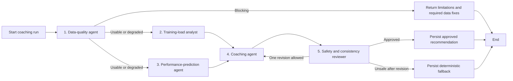

# Controlled Agent Workflow

## Status

- Project: RunCoach AI
- Document state: Initial approved workflow
- Last updated: 2026-08-23
- Orchestrator: LangGraph
- Number of specialized agents: Five
- LLM required for deterministic analytics: No

## Purpose

The workflow converts validated analytical evidence into an understandable coaching
recommendation while preserving deterministic calculations, traceability, and safety.

It is a hybrid workflow. The word "agent" refers to a specialized graph responsibility with a
defined input, output, and decision authority. It does not imply that every node is an
autonomous LLM.

## Design principles

- Deterministic code owns measurements and calculations.
- Each agent has one bounded responsibility.
- Graph state is typed and versioned.
- Every conclusion references evidence identifiers.
- Data quality can block or reduce confidence.
- ML eligibility is checked before a prediction is used.
- LLM output is schema-constrained.
- Safety rules can reject or replace generated text.
- The graph has a bounded revision count.
- Provider-disabled and fake-provider execution must work in tests.
- Raw files and raw GPS tracks do not enter the graph.

## Workflow overview



The load and prediction branches may run independently after the quality gate. Parallel
execution is an optimization, not a requirement for the first implementation.

## Graph state

The graph uses a versioned state object.

| Field | Purpose |
|---|---|
| `run_id` | Stable coaching-run identifier |
| `graph_version` | Workflow behavior version |
| `athlete_id` | Domain owner |
| `goal_id` | Selected race goal |
| `as_of_time` | Strict evidence cutoff |
| `quality_report` | Coverage, freshness, issues, and eligibility |
| `load_analysis` | Deterministic load and trend evidence |
| `performance_analysis` | Baseline, optional ML, uncertainty, and limitations |
| `readiness_snapshot_id` | Persisted deterministic readiness result |
| `evidence_catalog` | Allowed evidence identifiers and values |
| `recommendation_draft` | Schema-constrained coaching proposal |
| `review_result` | Safety and consistency decision |
| `revision_count` | Bounded retry count |
| `final_recommendation` | Approved or deterministic fallback output |
| `warnings` | Structured non-medical warnings |
| `errors` | Sanitized workflow failures |

State contains references and minimized evidence. It does not contain raw files, credentials,
or full trackpoint streams.

## Agent 1: Data-quality agent

### Type

Deterministic service agent.

### Responsibility

Determine whether the requested analysis has sufficient, recent, and internally consistent
data.

### Inputs

- Athlete and goal identifiers.
- Evidence cutoff time.
- Import and quality findings.
- Sensor-coverage summaries.
- Physiology-profile availability.
- Metric and algorithm versions.
- Recent activity coverage.

### Checks

- Selected goal exists and is active.
- Required activity window exists.
- Import jobs affecting the period are complete.
- Blocking validation findings are absent.
- Duplicate candidates do not invalidate totals.
- Heart-rate, GPS, and load-method coverage are known.
- Physiology inputs required by a chosen calculation exist.
- Metric versions are compatible.
- Evidence predates the requested cutoff.

### Output

```json
{
  "status": "usable",
  "confidence": "medium",
  "blocking_issue_codes": [],
  "warning_issue_codes": ["LIMITED_HR_HISTORY"],
  "eligible_evidence_ids": ["daily-load:2026-08-23:v1"],
  "limitations": ["Historical heart-rate coverage is incomplete."]
}
```

Allowed statuses:

- `usable`
- `degraded`
- `insufficient`
- `blocked`

### Why necessary

Without an explicit gate, downstream agents can produce precise-looking conclusions from
incomplete or duplicated data. This agent makes data fitness a first-class result.

## Agent 2: Training-load analyst

### Type

Deterministic analytical agent.

### Responsibility

Retrieve and summarize approved training-load, trend, and readiness components.

### Inputs

- Quality-approved evidence identifiers.
- Selected goal.
- Versioned deterministic metric services.
- Recent daily and weekly summaries.

### Output

- Recent volume and duration.
- Long-run preparation.
- Intensity distribution.
- Acute and chronic load.
- Modeled fitness, fatigue, and form.
- Load-method coverage.
- Trend direction.
- Readiness components relevant to training.
- Evidence identifiers and limitations.

### Restrictions

- Does not calculate metrics inside an LLM prompt.
- Does not translate ACWR into injury probability.
- Does not compare incompatible load methods without a documented calibration.
- Does not hide missing historical heart-rate data.

### Why necessary

Separating load analysis from coaching language makes calculations reusable, testable, and
auditable.

## Agent 3: Performance-prediction agent

### Type

Deterministic baseline and governed ML agent.

### Responsibility

Produce an eligible race-performance estimate and clearly separate deterministic and ML
results.

### Inputs

- Goal distance and date.
- Prior verified performances.
- Riegel baseline service.
- ML model registry and eligibility status.
- Feature snapshot generated before the cutoff.
- Data-quality result.

### Decision sequence

1. Calculate the Riegel baseline.
2. Check for a recent same-distance baseline.
3. Determine whether an eligible ML artifact exists.
4. Check feature support and missing-data confidence.
5. Run ML only when all eligibility conditions pass.
6. Select the result allowed to inform coaching.
7. Return uncertainty and limitations.

### Output

```json
{
  "selected_method": "riegel-v1",
  "predicted_time_seconds": 5480,
  "lower_seconds": null,
  "upper_seconds": null,
  "confidence": "medium",
  "ml_eligible": false,
  "evidence_ids": ["personal-best:half-marathon:2026-01-01"],
  "limitations": ["Insufficient chronological ML test events."]
}
```

### Why necessary

This boundary prevents an experimental model from silently overriding a transparent baseline
and supports model-governance discussion in the graduation defense.

## Agent 4: Coaching agent

### Type

Schema-constrained LLM agent, with a deterministic template implementation when the provider
is disabled.

### Responsibility

Transform approved evidence into a concise recommendation and explanation.

### Inputs

Only:

- Goal context.
- Quality report.
- Load analysis.
- Performance analysis.
- Readiness components.
- Allowed evidence catalog.
- Coaching-output policy.

### Output contract

```json
{
  "summary": "Prioritize recovery before the next quality session.",
  "actions": [
    {
      "action": "Keep the next run easy.",
      "time_horizon": "next_session",
      "evidence_ids": ["daily-load:2026-08-23:v1"]
    }
  ],
  "rationale": [
    {
      "claim": "Recent modeled fatigue is elevated relative to the prior trend.",
      "evidence_ids": ["daily-load:2026-08-23:v1"]
    }
  ],
  "confidence": "medium",
  "warnings": [],
  "limitations": ["Historical heart-rate coverage is incomplete."]
}
```

### Restrictions

The coaching agent cannot:

- Query arbitrary database tables.
- Parse raw files.
- Calculate or change trusted metrics.
- Introduce evidence identifiers absent from the catalog.
- Diagnose an injury or illness.
- Guarantee a target result.
- Prescribe medication or treatment.
- Conceal uncertainty.
- Create a major training-load increase without supporting policy and evidence.

### Why necessary

Natural-language synthesis is useful because a user needs a coherent interpretation across
several validated signals. This is the narrow role in which an LLM adds value.

## Agent 5: Safety and consistency reviewer

### Type

Deterministic policy validator with an optional separate LLM review for semantic
contradictions.

### Responsibility

Approve, revise, or replace the coaching draft.

### Deterministic checks

- Output matches the schema.
- Every factual claim has allowed evidence.
- Evidence cutoff and versions are valid.
- Recommendation does not contradict data-quality limitations.
- Recommendation does not contradict the selected goal.
- Medical diagnosis language is absent.
- Certainty language matches confidence.
- An experimental or ineligible ML result is not presented as authoritative.
- Warnings and limitations are preserved.
- Action count and time horizon remain bounded.
- Revision count is within the configured maximum.

### Optional semantic review

A separate provider call may inspect whether the prose contradicts the structured evidence.
It cannot override deterministic rejection rules.

### Decisions

- `approve`
- `revise`
- `fallback`

Only one revision loop is allowed in the MVP.

### Why necessary

Generated prose can be syntactically valid while still being misleading or inconsistent.
Independent review creates a measurable safety boundary and a useful agent-system concept.

## Evidence contract

An evidence item contains:

| Field | Meaning |
|---|---|
| `evidence_id` | Stable identifier |
| `evidence_type` | Metric, quality issue, prediction, PB, goal, or readiness component |
| `value` | Minimized typed value |
| `unit` | Explicit unit |
| `as_of_time` | Evidence cutoff |
| `algorithm_version` | Calculation definition |
| `coverage` | Relevant sensor or data coverage |
| `confidence` | Evidence confidence |
| `source_refs` | Persisted source identifiers |
| `limitations` | Structured caveats |

The coaching and review agents receive only evidence items approved by the data-quality agent.

## Provider abstraction

The coaching module defines a provider-neutral interface similar to:

```python
from typing import Protocol, TypeVar

from pydantic import BaseModel

OutputT = TypeVar("OutputT", bound=BaseModel)


class StructuredLanguageModel(Protocol):
    def generate(
        self,
        *,
        instructions: str,
        evidence: dict[str, object],
        output_type: type[OutputT],
    ) -> OutputT:
        """Return validated structured output."""
        ...
```

Initial implementations:

- `DisabledLanguageModel`: returns a clear provider-disabled result.
- `FakeLanguageModel`: deterministic test implementation.
- `OpenAILanguageModel`: optional production adapter.

Provider-specific request objects must not leak into domain or graph state.

## Prompt policy

Prompts should:

- Define the role and decision boundary.
- State that evidence is authoritative.
- Require evidence identifiers for factual claims.
- Require uncertainty and limitations.
- Prohibit medical diagnosis.
- Define the output schema outside free-form prose where supported.
- Keep stable policy text separate from dynamic athlete evidence.
- Avoid raw sensor dumps and unnecessary personal context.

Prompts and output schemas are versioned together.

## Persistence and audit

Persist:

- Coaching-run ID and graph version.
- Evidence cutoff.
- Input evidence identifiers.
- Node start and completion times.
- Deterministic decision results.
- Provider and model identifier when enabled.
- Provider request identifier when available.
- Token usage when available.
- Validated node output.
- Review decision and reasons.
- Final approved or fallback recommendation.

Do not persist hidden chain-of-thought. Store only user-facing rationale, structured decisions,
and operational metadata.

## Failure handling

| Failure | Result |
|---|---|
| Missing or invalid data | Stop with limitations |
| Deterministic calculation failure | Fail run with sanitized error |
| No eligible ML model | Continue with deterministic baseline |
| LLM disabled | Use deterministic coaching template |
| Provider timeout | Retry once only when safe, then fallback |
| Invalid structured output | Request one correction, then fallback |
| Unsupported evidence reference | Reject draft |
| Medical or contradictory language | Revise once or fallback |
| Persistence failure | Do not present result as saved or approved |

Provider calls and persisted side effects require idempotency keys based on run and node IDs.

## Human review

Human-in-the-loop approval is not required for every MVP recommendation. The UI may add an
optional confirmation step for:

- Recommendations marked low confidence.
- Ambiguous duplicate data affecting a goal.
- Experimental ML outputs.
- Safety warnings that require acknowledgement.

The graph must not imply that software approval replaces professional judgment.

## Testing strategy

### Unit tests

- Data-quality routing for usable, degraded, and blocked evidence.
- Load-agent use of deterministic service outputs.
- ML eligibility and baseline fallback.
- Evidence-reference validation.
- Medical-language rejection.
- Revision-limit enforcement.
- Deterministic fallback generation.

### Contract tests

Run the same schema cases against fake and configured providers. Network-backed tests remain
optional and must not run in normal CI without explicit credentials.

### Snapshot tests

Use carefully reviewed structured outputs for stable deterministic templates. Avoid brittle
snapshots of unrestricted prose.

### End-to-end graph tests

Cover:

- Valid evidence to approved recommendation.
- Missing data to limitations.
- Ineligible ML to Riegel explanation.
- Unsafe draft to one revision.
- Repeated unsafe draft to deterministic fallback.
- Provider-disabled execution.

## Why LangGraph is justified

LangGraph demonstrates:

- Explicit shared state.
- Specialized nodes.
- Conditional routing.
- Parallelizable analysis branches.
- Bounded revision loops.
- Persistence and replay concepts.
- Optional human interruption.
- Testable workflow topology.

A plain function pipeline would be simpler for a purely linear flow. LangGraph is selected
because the approved workflow has multiple decision branches, a review loop, persisted state,
and provider-independent fallback behavior.

The implementation must remain small. Adding conversational memory, free-form tool selection,
or agent-to-agent chat is outside the MVP.

## Academic concepts demonstrated

- Multi-agent role specialization.
- Hybrid symbolic and generative AI.
- State-machine and graph orchestration.
- Tool use through typed deterministic services.
- Guardrails and output validation.
- Human-in-the-loop design.
- Auditability and model governance.
- Fault handling and idempotency.

## Limitations

- Specialized graph nodes are not independent intelligent entities.
- Safety rules cannot guarantee that all advice is appropriate.
- An LLM reviewer may share failure modes with the coaching LLM.
- Recommendations are limited by missing context such as sleep, pain, illness, weather, and
  nutrition.
- The workflow is evaluated on one athlete and cannot claim general coaching validity.
- Provider behavior, cost, and availability can change.