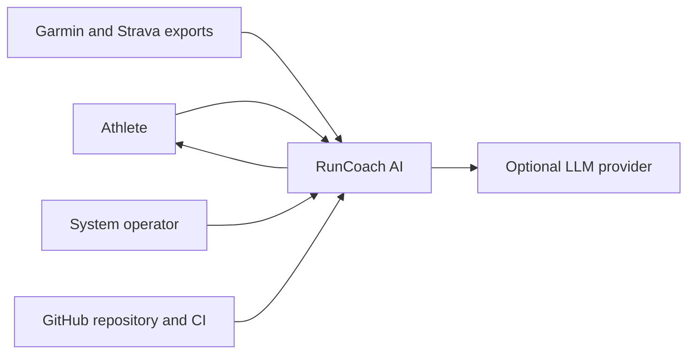
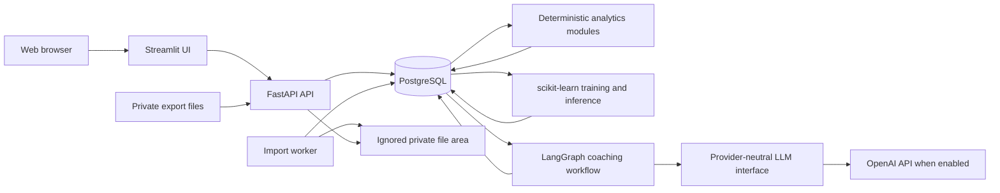
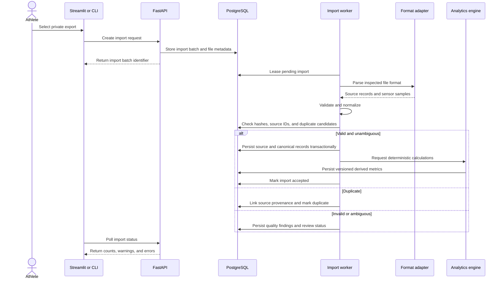
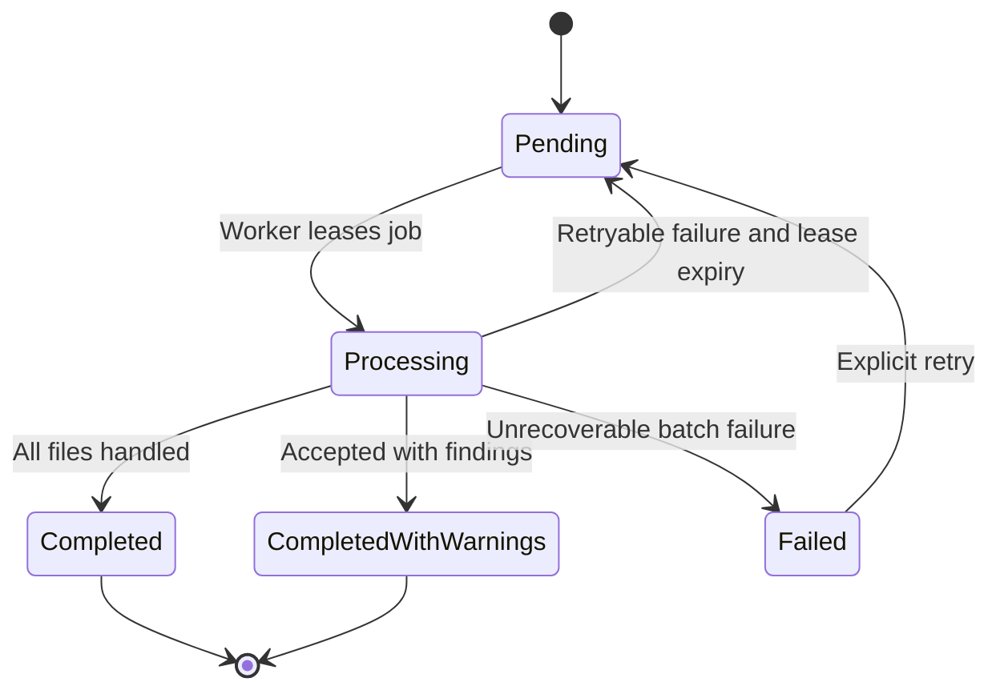
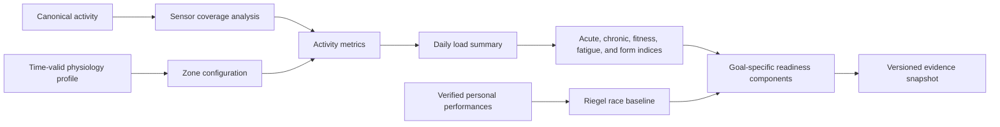
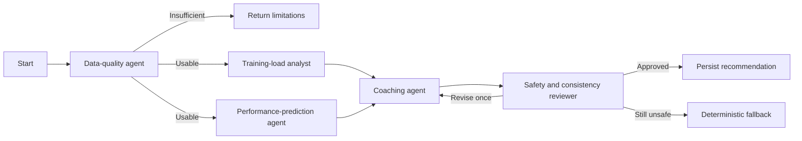
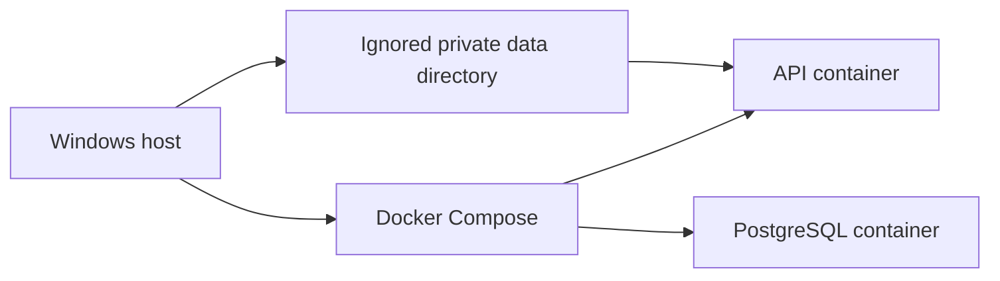
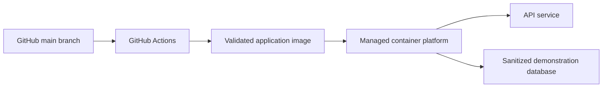

# Architecture

## Status

- Project: RunCoach AI
- Document state: Initial approved baseline
- Last updated: 2026-08-23
- Architecture style: Modular monolith with separate runtime processes
- Current implementation: Milestone 1A foundation

## Architectural drivers

The architecture is shaped by these priorities:

1. Complete a defensible MVP within four weeks.
2. Preserve private activity data and source provenance.
3. Keep deterministic calculations independent from the LLM.
4. Support heterogeneous exports without depending on Garmin API access.
5. Make data-quality, model, and recommendation decisions auditable.
6. Demonstrate data-engineering, ML, cloud, and agent-workflow concepts without artificial
   distributed complexity.
7. Remain reproducible on Windows development machines, Docker, CI, and a managed cloud container platform.

## Primary decision

RunCoach AI uses a modular monolith.

All domain modules share:

- One Python repository.
- One versioned application release.
- One PostgreSQL database.
- One set of domain contracts.
- One CI pipeline.

The code may run as separate processes:

- FastAPI API.
- Database-backed import worker.
- Streamlit UI.
- Future scheduled analytics process, only if required.

Separate processes do not make these modules independent microservices. They remain one
application and are changed, tested, and deployed together.

## System context

### External actors and systems

| Actor or system | Interaction | Trust consideration |
|---|---|---|
| Athlete | Imports files, sets goals, reviews analytics | Owns the private source data |
| Garmin and Strava exports | Supply files created outside the system | Schemas and completeness may vary |
| LLM provider | Interprets approved structured evidence | Receives minimized data only |
| GitHub | Stores source and runs CI | Must never receive secrets or raw exports |
| Managed cloud container platform | Hosts sanitized demonstration | Must not become the authoritative private store |

## Container view

### Current Milestone 1A containers

The current Docker Compose foundation contains:

- `api`: FastAPI application running as a non-root user.
- `db`: PostgreSQL 17 with a named development volume.

The import worker and Streamlit UI are added only when their first behavior is implemented.

## Module boundaries

The target source structure is organized by responsibility:

| Module | Responsibility | Must not do |
|---|---|---|
| `api` | HTTP contracts, validation, dependency injection | Implement analytical formulas |
| `config` | Typed environment configuration | Contain secrets in source |
| `db` | SQLAlchemy base, sessions, repositories | Parse activity files |
| `profiles` | Athlete, physiology, and goal rules | Depend on Streamlit |
| `ingestion` | Adapter contracts, parsing, validation, normalization | Generate coaching prose |
| `quality` | Data-quality rules, issue severity, coverage | Silently repair ambiguous data |
| `activities` | Canonical activity and sensor domain behavior | Know provider-specific file structure |
| `analytics` | Deterministic metrics and readiness components | Call an LLM |
| `performance` | PB extraction and deterministic race baseline | Use post-event data in predictions |
| `ml` | Feature datasets, training, evaluation, inference | Hide failed baseline comparisons |
| `coaching` | Graph state, evidence assembly, provider abstraction | Recalculate trusted metrics |
| `ui` | Streamlit presentation and interaction | Duplicate domain calculations |

Dependencies should point inward toward stable domain contracts. UI, API, parsers, database,
and external providers are replaceable adapters around application and domain behavior.

## Import data flow

## Import-job state model

A PostgreSQL table provides a durable state machine. This avoids introducing Kafka or Redis
for a personal-scale batch workload.

Requirements:

- A worker lease has an expiry time.
- Processing is idempotent.
- Individual malformed files do not automatically fail the entire batch.
- Retry counts and sanitized error details are persisted.
- File bytes are not stored in the job table.

## Canonicalization and provenance

Provider records and canonical activities are separate concepts.

- An import file produces one or more source-activity records.
- Multiple source records may resolve to one canonical activity.
- Exact duplicates use file hashes or provider identifiers.
- Cross-source candidates use documented timestamp, duration, distance, and sport tolerances.
- Ambiguous candidates require review.
- A canonical activity selects one authoritative sensor stream instead of interleaving Garmin
  and Strava points.
- Source values remain available for audit.

Recent Garmin FIT data is expected to be richer, but source precedence is not finalized until
real exports are inspected.

## Deterministic analytics flow

Every derived result records:

- Athlete and source inputs.
- Calculation date.
- Algorithm name and version.
- Relevant parameter or profile version.
- Data-coverage information.
- Input hash where practical.

A recalculation creates or supersedes a versioned result rather than silently changing the
meaning of historical output.

## Machine-learning boundary

The ML module consumes a frozen feature dataset produced from persisted, versioned inputs.

It does not:

- Read future activity data when creating a pre-event feature row.
- Train directly from mutable dashboard queries.
- Replace deterministic baselines.
- Send private datasets to an LLM.

Model artifacts and experiment records include dataset manifest, feature version, split
strategy, parameters, metrics, and conclusion. A model may remain experimental when evidence
is insufficient.

## Coaching workflow boundary

The coaching graph receives a structured evidence snapshot, not raw activity files.

The LLM is used only by nodes that need language interpretation. Analytical nodes call typed,
deterministic services.

## API principles

- Version public domain endpoints under `/api/v1` when feature endpoints begin.
- Keep `/health/live` and `/health/ready` unversioned for operations.
- Use Pydantic request and response models.
- Return stable machine-readable error codes for domain failures.
- Do not expose database models directly.
- Use pagination for activity and issue collections.
- Reject unsupported or oversized uploads before parsing.
- Do not return raw credentials, stack traces, or private filesystem paths.

## Database principles

- PostgreSQL is the authoritative structured store.
- SQLAlchemy manages persistence mappings.
- Alembic manages all schema changes.
- Foreign keys and uniqueness constraints enforce critical invariants.
- JSONB is limited to flexible provenance, metric components, and graph state.
- Trackpoints use ordered keys and appropriate activity/time indexes.
- Bulk inserts avoid one transaction per trackpoint.
- SQLite is not treated as behaviorally equivalent in integration tests.

PostGIS and TimescaleDB are not required for the MVP. They may be evaluated only if a
measured query or geospatial requirement justifies them.

## Security and privacy boundaries

### Repository boundary

Allowed:

- Source code.
- Documentation.
- Synthetic or verified sanitized fixtures.
- `.env.example` with blank secrets.

Forbidden:

- Raw exports.
- `.env`.
- API credentials.
- Private database dumps.
- Identifying route coordinates.

### LLM boundary

Allowed by default:

- Calculated summary values.
- Goal type and relevant dates.
- Evidence identifiers.
- Data-quality and confidence flags.

Forbidden by default:

- Raw GPS points.
- Provider credentials.
- Exact home or frequently visited locations.
- Unnecessary names or account identifiers.
- Unvalidated medical conclusions.

### Cloud boundary

The free cloud demonstration uses sanitized or synthetic data. Local private data remains the
authoritative case-study dataset. Free-service filesystems are treated as ephemeral.

## Deployment view

### Local

### Cloud demonstration

The provider will be selected before the initial cloud deployment using current pricing,
service limits, regional availability, database lifecycle, sleep behavior, HTTPS support,
and the approved operating budget.

## Technology rationale

| Technology | Why selected and problem solved | Academic concept | Simpler alternative | Limitation |
|---|---|---|---|---|
| Python 3.12 | Shared language for API, parsing, analytics, and ML | Reproducible scientific software | Several scripts with system Python | One process is CPU-bound |
| `uv` | Fast lockfile-based dependency and interpreter management | Reproducible environments | `venv` and `pip` | Less familiar to some evaluators |
| FastAPI | Typed REST boundary and generated OpenAPI | Service contracts and validation | Streamlit calling Python directly | Adds an API process |
| Modular monolith | Clear modules without distributed overhead | Modularity and clean architecture | One large application module | Requires process or module separation for independent scaling |
| PostgreSQL | Transactions, constraints, relational history, JSONB | Data modeling and persistence | SQLite | Requires a managed service or container |
| SQLAlchemy | Typed persistence abstraction | ORM and repository patterns | Raw SQL only | Can hide inefficient queries |
| Alembic | Reproducible schema evolution | Database migration management | Manual SQL changes | Autogeneration requires review |
| Pandas and NumPy | Batch feature preparation and analytics | Vectorized data processing | Python loops | Memory-bound and not distributed |
| scikit-learn | Pipelines, baselines, and evaluation | Applied machine learning | Deterministic formula only | Dataset size may limit validity |
| Streamlit | Fast analytical interface | Data-product prototyping | React | Less frontend control |
| LangGraph | Explicit state and conditional safety routing | Controlled agent orchestration | Plain function chain | Can become unnecessary ceremony |
| OpenAI abstraction | Schema-constrained language interpretation | Generative AI integration | Templates only | Cost, privacy, and nondeterminism |
| Docker Compose | Reproducible local services | Containerization | Manual installation | Not production orchestration |
| GitHub Actions | Automated quality and build gates | CI/CD | Manual verification | Depends on hosted runners |
| Managed container platform | Public sanitized deployment | Cloud deployment | Local-only operation | Provider resource and availability constraints |

## Technology adoption assessment

The baseline architecture selects components that satisfy the current functional,
data-volume, reliability, privacy, and deployment requirements. The technologies below
remain valid evolution options. Each has an explicit adoption trigger that can be evaluated
from measured system needs and recorded in an architecture decision record.

### Kafka

Current imports are bounded batch jobs, and PostgreSQL provides durable job state and
idempotency. Kafka becomes appropriate when ingestion is continuous, multiple independent
consumers require replay, or measured throughput and retention requirements exceed the
database-backed job mechanism.

### Kubernetes

The current topology contains a small number of containerized processes, with Docker Compose
for local integration and a managed container platform for cloud operation. Kubernetes becomes
appropriate when autoscaling, multi-service scheduling, portability, self-healing, or platform
governance requirements justify operating a cluster.

### Microservices

The modular monolith preserves explicit domain boundaries while keeping transactions and
operations cohesive. A module becomes a candidate for independent deployment when ownership,
release cadence, scaling, security, or fault-isolation requirements differ enough to justify
network contracts, distributed consistency, and service-level observability.

### NoSQL

The core data has strong relationships and integrity requirements, while PostgreSQL JSONB
supports limited source-specific metadata. A specialized NoSQL store becomes appropriate when
measured access patterns, schema variability, distribution, or write volume cannot be served
effectively by the relational design.

### RAG and vector storage

The coaching workflow is grounded in structured, versioned analytical evidence. Retrieval
augmentation becomes appropriate when an approved and versioned knowledge corpus is introduced,
and only after retrieval relevance, citation accuracy, privacy, and recommendation impact can
be evaluated.

## Big Data positioning

The system demonstrates transferable data-engineering practices:

- Heterogeneous ingestion.
- Validation and normalization.
- Data lineage.
- Idempotency.
- Schema evolution.
- Time-series processing.
- Feature pipelines.
- Reproducible experiments.
- Containerized execution.

It does not demonstrate Big Data scale because one athlete's history fits on one machine and
does not require distributed storage or computation. This limitation must be stated in the
report and presentation.

## Open architectural questions

The following decisions require evidence gathered later:

- Exact Garmin and Strava adapter schemas after safe export inspection.
- Source precedence for duplicate sensor streams.
- Trackpoint retention and compression based on actual data volume.
- Final ML target after the performance-label audit.
- Exact free cloud provider and database lifecycle.
- Whether the import worker needs a separate cloud process for the demonstration.

Each resolved question should create or update an architecture decision record.