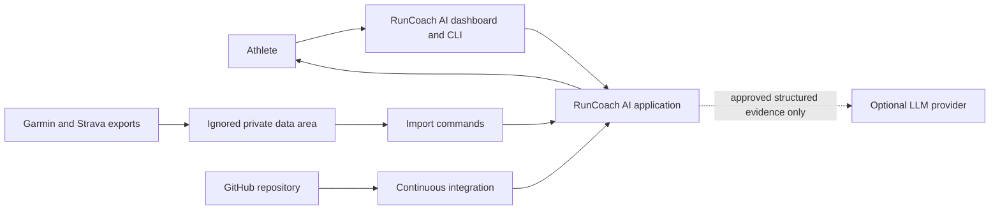
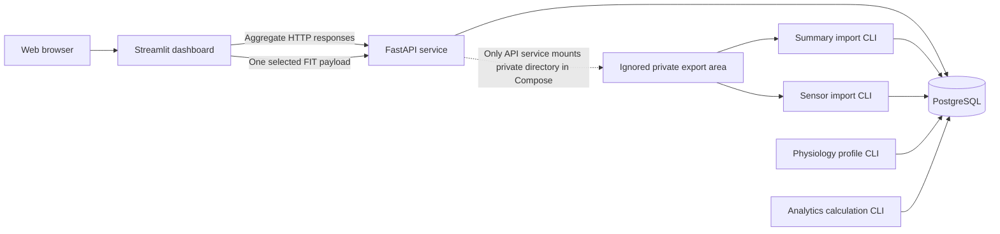
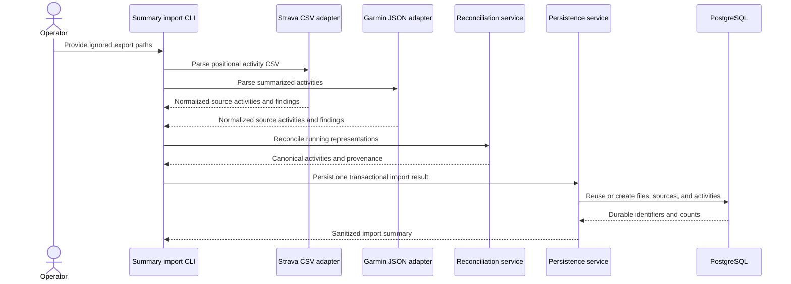
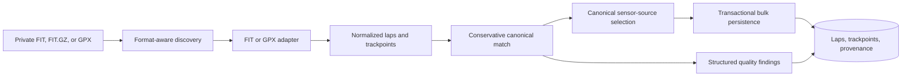
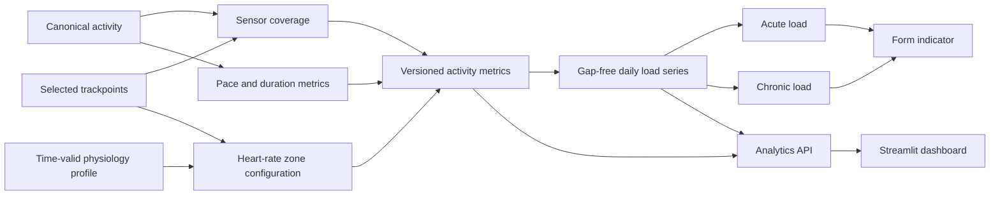
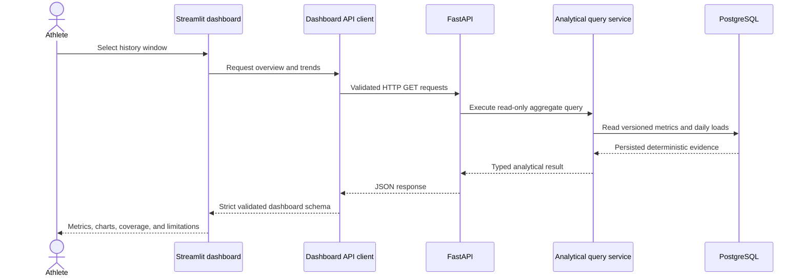
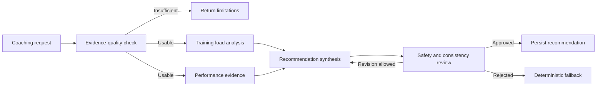
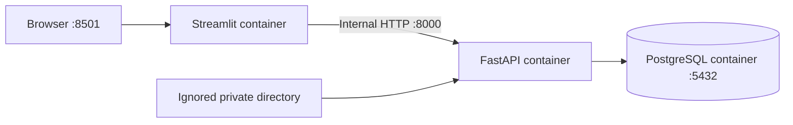
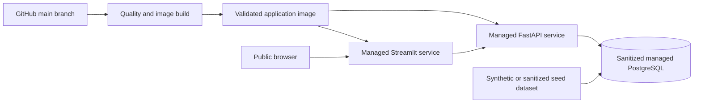

# Architecture

## Document status

- Project: RunCoach AI
- Document state: Living architecture aligned with the verified implementation
- Last updated: 2026-09-07
- Architecture style: Modular monolith with separate runtime processes
- Deployment model: Local private-data platform and sanitized cloud demonstration

## Purpose

RunCoach AI transforms heterogeneous Garmin and Strava exports into a canonical running
history, deterministic training analytics, performance evidence, and controlled coaching
recommendations.

This document describes:

- The architecture that is currently implemented and verified.
- The boundaries that protect privacy and scientific validity.
- The planned machine-learning and coaching components.
- The evidence required before introducing additional infrastructure.

Planned capabilities are identified explicitly and are not presented as operational.

## Architectural drivers

The architecture is shaped by the following priorities:

1. Preserve private activity data, credentials, and source provenance.
2. Keep deterministic calculations independent from language-model behavior.
3. Reconcile heterogeneous historical and recent data without losing lineage.
4. Support export-based operation without depending on Garmin API availability.
5. Make imports, calculations, predictions, and recommendations reproducible and auditable.
6. Separate presentation, service contracts, domain logic, and persistence.
7. Evaluate machine-learning validity against deterministic baselines and chronological
   holdouts.
8. Run reproducibly on Windows, Docker Compose, CI, and a managed container platform.
9. Adopt distributed infrastructure only when measured requirements justify its operational
   cost.

## Primary architectural decision

RunCoach AI uses a modular monolith.

All modules share:

- One Python repository.
- One versioned application release.
- One PostgreSQL system of record.
- One set of domain contracts.
- One dependency lockfile.
- One continuous-integration pipeline.

The application has separate runtime processes where process isolation solves a concrete
problem:

- FastAPI provides typed analytical queries and controlled coaching command contracts.
- Streamlit provides the interactive analytical interface.
- CLI processes perform private imports, profile configuration, and deterministic
  recalculation.
- PostgreSQL provides durable transactional persistence.

These processes are not independent domain microservices. They are released together and
share application modules and database contracts. This preserves modularity without adding
distributed transactions, network duplication, or independent-service operational overhead.

## Implementation status

### Operational capabilities

The verified implementation currently provides:

- Strava positional CSV parsing, including duplicate-header handling.
- Garmin summarized-activity JSON parsing with explicit unit normalization.
- FIT, FIT.GZ, and namespace-aware GPX parsing.
- Conservative cross-source running-activity reconciliation.
- Transactional and idempotent import persistence.
- File, source-record, canonical-record, and field-level provenance.
- PostgreSQL storage for activities, laps, and ordered trackpoints.
- Time-valid physiology profiles.
- Deterministic pace, sensor coverage, heart-rate zones, Edwards TRIMP, and duration load.
- Gap-free daily acute, chronic, fitness, fatigue, and form series.
- Versioned input hashing and reproducible recalculation.
- Read-only analytics overview and longitudinal trend endpoints.
- A validated Streamlit dashboard using FastAPI rather than direct database access.
- Training-context race-performance estimates with explicit uncertainty and preparation.
- A goal-based training planner with progressive weekly load, dated sessions, durable goals,
  and immutable refreshable plan versions.
- Weekly plan adherence and plan-version adaptation history derived from canonical runs.
- First-week session matching with conservative missed-quality guardrails.
- One-command coaching-data updates with hash-first discovery and stable weekly schedules.
- A dashboard-to-API FIT upload command that imports one run and refreshes coaching atomically.
- A provider-neutral conversational coaching boundary over privacy-minimized deterministic
  evidence, with cited structured responses and deterministic fallback behavior.
- An optional stateless OpenAI Responses API adapter using strict structured output.
- New-athlete registration with one-to-one accounts, revocable opaque sessions, mandatory bounded
  Strava-history ZIP processing, resumable onboarding, and append-only model-research consent.
- Database-backed login and logout, hashed opaque bearer sessions, a Streamlit credential gate,
  and session-derived athlete ownership for private analytics and coaching requests.
- Health-checked PostgreSQL, FastAPI, and Streamlit Compose services.

### Planned capabilities

The following remain planned and require their own implementation and validation evidence:

- Persisted automatic rescheduling beyond the first detailed training week.
- A machine-learning experiment selected after a label audit.
- Controlled LangGraph orchestration over the implemented coaching-run audit records.
- Sanitized cloud deployment.

## System context

### External actors and trust boundaries

| Actor or system | Interaction | Trust consideration |
|---|---|---|
| Athlete | Imports private exports and reviews analytics | Owns the source data and goals |
| Garmin and Strava exports | Supply externally generated files | Schemas and completeness can vary |
| GitHub | Stores source and runs CI | Receives no secrets or raw personal exports |
| Managed container platform | Hosts a sanitized demonstration | Is not the authoritative private store |
| Optional LLM provider | Explains approved structured evidence | Receives minimized, validated inputs only |

## Current runtime architecture

### Runtime responsibilities

| Runtime | Responsibility | Data access |
|---|---|---|
| PostgreSQL | Durable canonical, source, sensor, profile, and analytical state | Local volume or managed database |
| FastAPI | Typed queries, controlled upload commands, and health endpoints | PostgreSQL and configured private mount |
| Streamlit | Interactive visualization, evidence presentation, and upload transport | FastAPI only |
| Import CLI | Parsing, validation, reconciliation, and persistence | Private files and PostgreSQL |
| Analytics CLI | Versioned deterministic recalculation | PostgreSQL |

The API waits for PostgreSQL readiness. The dashboard waits for API readiness. The dashboard
container does not mount private files, receive an athlete UUID, or connect directly to
PostgreSQL. It holds the raw bearer token only in Streamlit session memory; PostgreSQL stores only
the token hash, expiry, last-seen time, and revocation state.

## Logical module boundaries

| Module | Responsibility | Boundary |
|---|---|---|
| `config` | Typed environment configuration | Does not contain committed secrets |
| `ingestion` | Parsing, validation, normalization, and reconciliation | Does not persist directly or generate coaching prose |
| `db` | SQLAlchemy models, repositories, transactions, and analytical queries | Does not parse provider files or render UI |
| `analytics` | Deterministic activity and workload calculations | Does not call an LLM or depend on Streamlit |
| `api` | HTTP schemas, routing, validation, and dependency injection | Does not implement analytical formulas |
| `dashboard` | API client, response validation, and presentation | Does not query PostgreSQL or recalculate domain metrics |
| `performance` | Planned PB extraction and deterministic race baselines | Does not use post-event information in pre-event estimates |
| `ml` | Planned datasets, training, evaluation, and inference | Does not hide failed baseline comparisons |
| `coaching` | Shared import-to-analytics-to-plan orchestration | Does not replace deterministic calculations |

Dependencies point toward stable contracts and deterministic domain behavior. Presentation,
HTTP, database, file-format, and external-provider concerns remain replaceable adapters.

## Ingestion architecture

### Summary import flow

### Raw sensor import flow

### Ingestion invariants

- Raw files remain in ignored private directories.
- File content hashes provide file-level idempotence.
- Provider identifiers and fingerprints provide record-level idempotence.
- Parsing produces source-neutral contracts before persistence.
- Source units are normalized explicitly and tested with calibrated examples.
- Malformed or ambiguous inputs create structured findings rather than silent repairs.
- One canonical activity can retain multiple source representations.
- Bulk sensor persistence avoids one transaction per trackpoint.
- Re-importing unchanged exports creates no duplicate canonical activities or sensor rows.

## Canonicalization and provenance

Provider records and canonical activities are separate entities.

- An import file can produce multiple source-activity records.
- Multiple source records can resolve to one canonical activity.
- Exact duplicates use hashes, provider identifiers, or stable fingerprints.
- Cross-source matching uses sport, timestamp, duration, and distance tolerances.
- Ambiguous matches are not resolved automatically.
- Canonical fields retain the source representation that supplied each value.
- One authoritative sensor stream is selected rather than interleaving provider trackpoints.

Inspection of the available exports established the following precedence:

- Garmin is preferred for recent sensor data when matching raw activity detail exists.
- Strava supplies the longer historical activity record.
- Strava remains the fallback when Garmin raw detail is unavailable.
- Missing historical sensor values remain missing and are not interpreted as zero.

This precedence is a versioned data-resolution decision, not a claim that one provider is
universally more accurate.

## Persistence architecture

PostgreSQL is the authoritative structured store. SQLAlchemy defines mappings and invariants,
while Alembic provides reproducible schema evolution.

### Implemented table groups

| Group | Tables | Purpose |
|---|---|---|
| Identity | `athletes`, `physiology_profiles` | Athlete scope and time-valid calculation inputs |
| Import control | `import_batches`, `import_files` | Durable import state and file identity |
| Provenance | `source_activities`, `source_activity_files`, `activity_field_sources` | Source lineage and canonical resolution |
| Data quality | `data_quality_issues` | Structured findings and resolution state |
| Canonical activity | `activities`, `laps`, `trackpoints` | Running history and selected sensor observations |
| Analytics | `activity_metrics`, `daily_loads` | Versioned activity and longitudinal calculations |

### Database principles

- Foreign keys and uniqueness constraints enforce critical invariants.
- Check constraints enforce enumerations and plausible structural ranges.
- Timestamps use timezone-aware storage.
- Ordered trackpoint keys preserve sensor sequence.
- Indexes support athlete/date, activity/time, and provenance queries.
- JSONB is limited to bounded metadata and versioned analytical components.
- Application services define transaction boundaries.
- SQLite is not treated as behaviorally equivalent to PostgreSQL in integration testing.

PostGIS, TimescaleDB, and partitioning remain adoption options. They become relevant only when
measured geospatial queries, row volume, retention policy, or maintenance cost demonstrates a
benefit.

## Deterministic analytics architecture

Every derived result records or can resolve:

- Athlete and canonical activity inputs.
- Algorithm name and version.
- Applicable physiology-profile version.
- Calculation timestamp.
- Input hash where practical.
- Sensor coverage and method availability.

The language model never calculates pace, heart-rate zones, TRIMP, training load, fitness,
fatigue, form, race prediction, or readiness values.

### Current calculation methods

| Result | Method |
|---|---|
| Pace | Moving time divided by distance with explicit availability rules |
| Sensor coverage | Valid observations divided by eligible observations |
| Heart-rate zones | Five-zone percentage-of-observed-maximum method |
| Heart-rate load | Edwards TRIMP when heart-rate evidence is sufficient |
| Historical longitudinal load | Effective running-duration minutes |
| Acute load | Seven-day exponential recurrence |
| Chronic load | Forty-two-day exponential recurrence |
| Form | Chronic load minus acute load |

These quantities are modeled indicators. They are not direct physiological measurements or
medical diagnoses.

## API architecture

The API is a typed boundary over persisted deterministic results and narrowly scoped commands.

### Implemented endpoints

| Endpoint | Purpose |
|---|---|
| `GET /health/live` | Process liveness |
| `GET /health/ready` | Database-backed readiness |
| `GET /api/v1/analytics/overview` | Current or exact-date analytical summary |
| `GET /api/v1/analytics/trends` | Calendar-week training and daily workload series |
| `GET /api/v1/analytics/performance/label-audit` | Local minimized performance-review queue |
| `PUT /api/v1/analytics/performance/label-audit/{review_token}` | Save one local label and rerun validation |
| `GET /api/v1/coaching/plans/active/tracking` | Active plan adherence and recommendation |
| `POST /api/v1/coaching/runs` | Stream one FIT run, import it, and refresh coaching state |
| `POST /api/v1/coaching/chat` | Explain minimized current evidence conversationally |

### API principles

- Feature endpoints are versioned under `/api/v1`.
- Pydantic models define response contracts.
- Database models are not serialized directly.
- Query services are read-only and use persisted analytical versions.
- The run-upload command accepts only FIT or FIT.GZ, enforces a 25 MiB limit, stages data under
  the ignored private directory, and deletes the staged file after parsing.
- Domain failures map to stable HTTP behavior.
- Aggregate endpoints expose no athlete UUID, source filename, credential, or raw coordinate.
- Local label-review responses replace activity identities with opaque dataset-scoped tokens,
  omit private titles, and are unavailable in the production environment.
- The chat endpoint accepts at most eight prior turns and exposes evidence IDs, limitations,
  execution mode, context version, and prompt version in every response.
- New collections require pagination and explicit filtering contracts.

## Dashboard architecture

The Streamlit dashboard is an authenticated presentation adapter, not an alternative analytical
engine. Private requests carry an opaque bearer token, and FastAPI resolves the athlete owner from
the corresponding database session before invoking analytics or coaching services.

For a daily activity update, the athlete selects one FIT file and edits its title in Streamlit.
The dashboard client sends the bytes directly to `POST /api/v1/coaching/runs`. FastAPI stages the
payload privately, parses and hashes it, skips already imported content, persists new canonical
sensor evidence, recalculates versioned analytics, preserves the active detailed week when
appropriate, and returns the current session match and recommendation in one response.

Dashboard responsibilities include:

- Displaying totals and selected analytical windows.
- Visualizing weekly volume, pace, elevation, and workload.
- Showing missing-data coverage and method provenance.
- Preserving empty calendar weeks on chart time axes.
- Reporting unavailable values rather than manufacturing zeros.
- Reviewing private candidate performances one at a time through a minimized, local-only API
  contract that immediately refreshes chronological validation.
- Transporting a user-selected FIT payload to the controlled API command.
- Holding bounded conversational history in the browser session and presenting cited coaching
  evidence and limitations.

The dashboard does not parse or persist files, query PostgreSQL, calculate training metrics, or
access raw GPS coordinates. It holds the selected upload only long enough to send it to FastAPI.

## Machine-learning boundary

The machine-learning module is planned but not yet operational. Its final supervised target
depends on a documented label audit.

The module will consume a frozen, versioned feature dataset produced from persisted evidence.
It will not:

- Read information occurring after a prediction timestamp.
- Train directly from mutable dashboard queries.
- Replace the deterministic Riegel baseline.
- Present an underpowered experiment as generalizable evidence.
- Send the private dataset to an external LLM.

Experiment records will include dataset manifest, feature version, chronological split,
parameters, baseline results, candidate-model results, limitations, and conclusion.

## Coaching and LLM boundary

The deterministic planning path is operational: it combines current fitness, recent training
volume, target-distance preparation, race date, target time, and available running days without
calling an LLM. Selected goals and generated plans can be persisted as immutable versioned
snapshots. Refreshing after new imports reuses an identical plan or supersedes it with a new
version when the evidence-derived output changes. Completed-session adherence and the
conversational coaching API are operational. The first conversational slice assembles a versioned,
privacy-minimized evidence catalog from analytics, current-fitness, verified-PB, active-goal,
plan-adherence, latest-completed-session, and upcoming-session query services. A deterministic
template answers common questions, including post-run debriefs, and remains the fallback whenever
model generation is disabled or rejected.

The optional OpenAI adapter uses the Responses API with strict JSON-schema output and request
storage disabled. Generated evidence references are checked against the supplied catalog, and a
deterministic reviewer rejects unsupported citations, strong guarantees, and selected medical
language. Conversation history remains in the Streamlit session and raw questions are not stored.
Every successful answer now creates one transactional coaching-run record, three ordered audit
steps for evidence assembly, generation mode, and safety review, plus the final approved or
deterministic-fallback recommendation. The minimized state retains only a question hash and
length, workflow versions, evidence identifiers, and counts. LangGraph routing, provider request
metadata, and a bounded semantic revision loop remain planned.

Raw activity files, athlete identifiers, source filenames, credentials, and raw GPS tracks are
outside the LLM boundary. The provider receives only aggregate values, deterministic session
prescriptions, evidence identifiers, limitations, the current question, and at most eight recent
conversation turns.

## Security and privacy architecture

### Repository boundary

Allowed repository content:

- Source code and migrations.
- Architecture and methodology documentation.
- Synthetic or verified sanitized fixtures.
- `.env.example` containing no secret value.

Private local content:

- Raw Garmin and Strava exports.
- Extracted activity files.
- `.env` and API credentials.
- Private database dumps.
- Identifying route coordinates.

### Runtime boundary

- PostgreSQL credentials are supplied through environment variables.
- The API and dashboard run as non-root users.
- Only the API service receives the private-data mount in Compose.
- The dashboard receives only an internal API URL.
- API response schemas exclude private identifiers and raw coordinates.
- Logs and errors use sanitized summaries.

### Cloud boundary

- Cloud demonstration data is synthetic or explicitly sanitized.
- The cloud database is not the authoritative private store.
- Raw personal archives are not copied into container images or cloud volumes.
- Runtime secrets are provided by the platform secret mechanism.
- Public responses and screenshots are reviewed for identifying content.

## Deployment architecture

### Local Compose topology

Compose health dependencies are:

1. PostgreSQL becomes healthy.
2. FastAPI readiness confirms database access.
3. Streamlit starts after FastAPI is healthy.
4. Streamlit health confirms its web process is available.

The API and dashboard use the same locked application image with different runtime commands.
This demonstrates process separation while avoiding duplicate source packages and releases.

### Sanitized cloud topology

The cloud provider will be selected using current evidence about container support, managed
PostgreSQL lifecycle, HTTPS, service sleep behavior, regional availability, secrets, logs,
backup options, and operating cost.

## Quality, testing, and delivery

The continuous-integration contract includes:

- Locked Python 3.12 dependency installation.
- Ruff formatting and linting.
- Strict mypy checking.
- Pytest with branch coverage and a repository-wide minimum.
- Alembic schema-drift detection.
- Docker Compose validation.
- Application-image build.

Test layers include:

- Parser unit tests with sanitized fixtures.
- Reconciliation and idempotence tests.
- PostgreSQL model and persistence tests.
- Deterministic analytical golden tests.
- API query and endpoint tests.
- Dashboard client and response-schema tests.
- Container health and live smoke tests.

Code coverage measures exercised implementation paths. It does not establish physiological,
statistical, or coaching validity; those require separate methodology and evaluation.

## Technology rationale

| Technology | Selection purpose | Concept demonstrated | Simpler alternative | Limitation |
|---|---|---|---|---|
| Python 3.12 | Shared language for parsing, analytics, API, UI, and ML | Reproducible scientific software | Independent scripts | CPU-bound work requires process or task separation |
| `uv` | Interpreter and lockfile-based dependency reproducibility | Environment management | `venv` and `pip` | Less familiar than traditional Python tooling |
| FastAPI | Typed service contract between presentation and persistence | REST design and validation | Streamlit calling repositories directly | Adds a runtime process and HTTP boundary |
| PostgreSQL | Transactional canonical history and time-series persistence | Relational modeling and integrity | SQLite | Requires a service or managed database |
| SQLAlchemy | Typed persistence mappings and transaction services | ORM and repository patterns | Raw SQL | Poorly designed queries can be obscured |
| Alembic | Versioned and reproducible schema evolution | Migration management | Manual schema changes | Generated migrations require review |
| Pandas | Dashboard shaping and future feature-dataset preparation | Tabular data processing | Lists and dictionaries | Memory-bound and not distributed |
| Plotly | Interactive evidence visualization | Analytical presentation | Static charts | Increases image size and client payload |
| Streamlit | Rapid analytical interface over typed API contracts | Data-product delivery | Custom React client | Less control over frontend architecture |
| scikit-learn | Planned baselines, pipelines, and temporal evaluation | Applied machine learning | Deterministic formulas only | Dataset size can prevent useful generalization |
| LangGraph | Planned explicit coaching state and review routing | Controlled agent orchestration | Function pipeline | Adds little value without meaningful branching |
| OpenAI abstraction | Planned schema-constrained explanation generation | Generative AI integration | Deterministic templates | Cost, privacy, latency, and nondeterminism |
| Docker Compose | Reproducible local multi-process integration | Containerization | Manual service startup | Not a production orchestrator |
| GitHub Actions | Automated quality and image-build gates | Continuous integration | Manual verification | Depends on hosted-runner availability |
| Managed container platform | Sanitized public demonstration | Cloud deployment | Local-only demonstration | Provider limits and pricing can change |

## Data-engineering and Big Data positioning

The platform demonstrates transferable data-engineering capabilities:

- Heterogeneous file ingestion.
- Schema and unit normalization.
- Data-quality findings.
- Source and field lineage.
- File-level and record-level idempotence.
- Cross-source entity resolution.
- Transactional persistence.
- Schema evolution.
- Ordered sensor-series processing.
- Versioned analytical pipelines.
- Reproducible experiments and containerized delivery.

The current workload is not Big Data scale. One athlete's history fits on one machine and does
not require distributed storage or computation. The project demonstrates Big Data engineering
principles without making a false scale claim.

## Evidence-based evolution options

Additional technologies remain valid when their adoption triggers are observed.

### Kafka

PostgreSQL currently provides durable import state and idempotence for bounded batch jobs.
Kafka becomes appropriate when ingestion is continuous, multiple independent consumers need
replay, or measured throughput and retention exceed the database-backed job mechanism.

### Kubernetes

Docker Compose and a managed container platform currently satisfy the small runtime topology.
Kubernetes becomes appropriate when autoscaling, multi-service scheduling, portability,
self-healing, or platform governance justifies operating a cluster.

### Microservices

The modular monolith preserves domain boundaries with cohesive transactions. A module becomes
a candidate for independent deployment when ownership, release cadence, scaling, security,
or fault-isolation requirements justify network contracts and distributed consistency.

### Specialized NoSQL or time-series storage

PostgreSQL currently serves relational integrity, JSONB metadata, and indexed trackpoints. A
specialized store becomes appropriate when measured access patterns, distribution, retention,
or write volume cannot be served effectively by the relational design.

### RAG and vector storage

The coaching workflow is grounded in structured analytical evidence. Retrieval augmentation
becomes appropriate only when an approved, versioned knowledge corpus exists and retrieval
relevance, citation accuracy, privacy, and recommendation impact can be evaluated.

## Architectural decisions

The following decisions are recorded separately and remain authoritative:

- ADR-0001: Adopt a modular monolith.
- ADR-0002: Keep raw personal data outside the repository and public cloud demonstration.

Future decisions should create or update an ADR when they change persistence, deployment,
privacy, model evaluation, or external-provider boundaries.

## Open architectural questions

- Trackpoint retention and compression based on measured volume and query performance.
- Final machine-learning target after the performance-label audit.
- Cloud provider and database lifecycle based on current operational evidence.
- Whether import processing benefits from a separate cloud runtime process.
- Selection of an external identity provider versus versioned first-party password hashing before
  authenticated multi-athlete access is exposed publicly.
- Whether a scheduled recalculation process provides value beyond explicit versioned commands.

## Architectural invariants

The architecture remains acceptable only while these invariants hold:

1. Raw personal exports and secrets remain outside Git.
2. Cloud demonstrations use synthetic or explicitly sanitized data.
3. Deterministic metrics are calculated by versioned code, not an LLM.
4. Missing sensor evidence is represented explicitly.
5. Cross-source resolution retains provenance and avoids silent ambiguous matching.
6. Machine-learning evaluation is chronological and compared with a deterministic baseline.
7. The dashboard consumes API contracts and does not query PostgreSQL directly.
8. Public API responses contain no private identifier, filename, credential, or raw coordinate.
9. New infrastructure is justified by measured technical requirements.
10. Documentation distinguishes verified implementation from planned capability.
