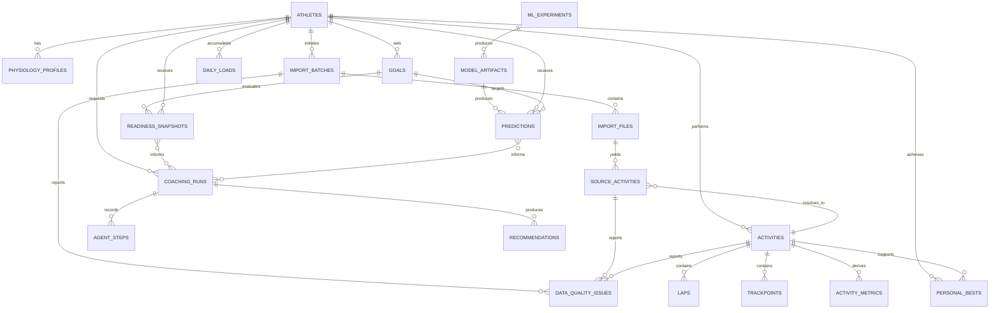

# Data Model

## Status

- Project: RunCoach AI
- Document state: Initial logical model
- Last updated: 2026-08-23
- Database: PostgreSQL 17
- ORM and migrations: SQLAlchemy 2 and Alembic

The logical model is approved, but the first domain migration will be created only after the
actual export formats and minimum ingestion fields are inspected.

## Modeling principles

- Retain `athlete_id` even though the MVP has one athlete.
- Separate imported source records from canonical activities.
- Preserve provenance rather than overwriting conflicting source values.
- Use canonical units and explicit missing values.
- Store timestamps in UTC and retain original timezone information.
- Version physiology settings, deterministic algorithms, and ML feature definitions.
- Use relational columns for stable queryable fields.
- Limit JSONB to flexible provenance, evidence components, and workflow state.
- Do not store raw export bytes in PostgreSQL.
- Do not expose private coordinates in the sanitized cloud database.

## Identifier and type conventions

| Concept | Convention |
|---|---|
| Domain primary key | UUID generated by the application or database |
| Ordered sensor sample | `(activity_id, sequence_number)` |
| Timestamp | PostgreSQL `TIMESTAMPTZ`, normalized to UTC |
| Local calendar date | PostgreSQL `DATE` using athlete timezone |
| Duration | Integer milliseconds where source precision supports it |
| Distance | `NUMERIC` meters |
| Speed | `NUMERIC` meters per second |
| Pace | Derived from distance and moving time, not primary truth |
| Elevation | `NUMERIC` meters |
| Heart rate | `SMALLINT` beats per minute |
| Cadence | `NUMERIC` steps per minute |
| Coordinates | Restricted latitude/longitude columns, nullable |
| Flexible components | PostgreSQL `JSONB` with a documented schema version |
| Algorithm version | Stable string such as `edwards-trimp-v1` |
| Source/file hash | Lowercase SHA-256 hexadecimal string |

Database enumerations are initially represented by constrained strings where practical.
PostgreSQL enum types may be introduced only when their migration cost is justified.

## Relationship overview

## Athlete and goal tables

### `athletes`

One row represents an athlete domain identity.

| Column | Type | Rules |
|---|---|---|
| `id` | UUID | Primary key |
| `display_name` | Text | Pseudonym permitted; not required in cloud |
| `timezone` | Text | Required IANA timezone |
| `created_at` | Timestamptz | Required |
| `updated_at` | Timestamptz | Required |

The MVP enforces one configured athlete at the application layer, not by removing
`athlete_id` from related tables.

### `physiology_profiles`

Stores time-valid calculation inputs.

| Column | Type | Rules |
|---|---|---|
| `id` | UUID | Primary key |
| `athlete_id` | UUID | Foreign key to `athletes` |
| `valid_from` | Date | Required |
| `valid_to` | Date | Nullable and exclusive |
| `observed_max_hr_bpm` | Smallint | Nullable, plausible-range check |
| `resting_hr_bpm` | Smallint | Nullable, plausible-range check |
| `lactate_threshold_hr_bpm` | Smallint | Nullable |
| `threshold_pace_seconds_per_km` | Integer | Nullable |
| `zone_method` | Text | Required versioned method name |
| `notes` | Text | Nullable |
| `created_at` | Timestamptz | Required |

Rules:

- Effective periods for one athlete must not overlap.
- Observed values are not presented as laboratory measurements.
- The current case-study defaults are stored at runtime, not hard-coded in source.

### `goals`

| Column | Type | Rules |
|---|---|---|
| `id` | UUID | Primary key |
| `athlete_id` | UUID | Foreign key |
| `race_type` | Text | `5k`, `10k`, `half_marathon`, or `marathon` |
| `race_date` | Date | Required |
| `target_time_seconds` | Integer | Nullable and positive |
| `status` | Text | `planned`, `active`, `completed`, or `cancelled` |
| `priority` | Text | `primary`, `secondary`, or `other` |
| `created_at` | Timestamptz | Required |
| `updated_at` | Timestamptz | Required |

An athlete may have only one active primary goal for the same race date.

## Import and provenance tables

### `import_batches`

Represents a durable import job and its aggregate result.

| Column | Type | Rules |
|---|---|---|
| `id` | UUID | Primary key |
| `athlete_id` | UUID | Foreign key |
| `status` | Text | Job-state constraint |
| `requested_at` | Timestamptz | Required |
| `started_at` | Timestamptz | Nullable |
| `completed_at` | Timestamptz | Nullable |
| `lease_expires_at` | Timestamptz | Nullable |
| `retry_count` | Integer | Default zero |
| `parser_bundle_version` | Text | Required |
| `total_files` | Integer | Default zero |
| `accepted_files` | Integer | Default zero |
| `rejected_files` | Integer | Default zero |
| `duplicate_files` | Integer | Default zero |
| `warning_count` | Integer | Default zero |
| `sanitized_error` | Text | Nullable |

Job states initially include `pending`, `processing`, `completed`,
`completed_with_warnings`, and `failed`.

### `import_files`

Stores file identity and processing metadata, not file bytes.

| Column | Type | Rules |
|---|---|---|
| `id` | UUID | Primary key |
| `import_batch_id` | UUID | Foreign key |
| `original_name` | Text | Private; sanitize before external display |
| `source_provider` | Text | `garmin`, `strava`, or `unknown` |
| `media_type` | Text | Nullable |
| `size_bytes` | Bigint | Non-negative |
| `sha256` | Character(64) | Required and indexed |
| `storage_key` | Text | Temporary logical key, not absolute path |
| `status` | Text | File-processing status |
| `detected_format` | Text | Nullable until inspection |
| `parser_name` | Text | Nullable |
| `parser_version` | Text | Nullable |
| `processed_at` | Timestamptz | Nullable |
| `deleted_at` | Timestamptz | Nullable |

An exact file hash already accepted for the same athlete is idempotent. Whether identical
bytes may be linked across athletes is deferred until multi-athlete support exists.

### `source_activities`

Represents one provider-specific activity record before or after canonical resolution.

| Column | Type | Rules |
|---|---|---|
| `id` | UUID | Primary key |
| `import_file_id` | UUID | Foreign key |
| `activity_id` | UUID | Nullable foreign key to canonical activity |
| `provider` | Text | Required |
| `external_activity_id` | Text | Nullable |
| `source_start_time` | Timestamptz | Required when parse succeeds |
| `source_sport` | Text | Required when parse succeeds |
| `source_distance_m` | Numeric | Nullable |
| `source_duration_ms` | Bigint | Nullable |
| `dedupe_fingerprint` | Character(64) | Nullable and indexed |
| `resolution_status` | Text | `unresolved`, `canonical`, `duplicate`, or `review` |
| `raw_metadata` | JSONB | Selected provenance fields only |
| `created_at` | Timestamptz | Required |

Constraints:

- `(provider, external_activity_id)` is unique when the external ID exists.
- A duplicate source record may point to an existing canonical activity.
- `raw_metadata` must not contain credentials or unbounded raw sensor payloads.

### `data_quality_issues`

| Column | Type | Rules |
|---|---|---|
| `id` | UUID | Primary key |
| `import_batch_id` | UUID | Foreign key |
| `source_activity_id` | UUID | Nullable foreign key |
| `activity_id` | UUID | Nullable foreign key |
| `code` | Text | Stable machine-readable code |
| `severity` | Text | `info`, `warning`, `error`, or `blocking` |
| `field_name` | Text | Nullable |
| `message` | Text | Sanitized human-readable detail |
| `observed_value` | JSONB | Nullable and privacy-reviewed |
| `resolution_status` | Text | `open`, `accepted`, `corrected`, or `dismissed` |
| `created_at` | Timestamptz | Required |
| `resolved_at` | Timestamptz | Nullable |

At least one of batch, source activity, or canonical activity must identify the affected
scope.

## Canonical activity tables

### `activities`

| Column | Type | Rules |
|---|---|---|
| `id` | UUID | Primary key |
| `athlete_id` | UUID | Foreign key |
| `sport` | Text | MVP initially supports running |
| `activity_type` | Text | Race, workout, easy, long, unknown, or other |
| `name` | Text | Nullable and private |
| `start_time_utc` | Timestamptz | Required |
| `original_timezone` | Text | Nullable |
| `local_start_date` | Date | Required |
| `distance_m` | Numeric(12,3) | Non-negative |
| `moving_time_ms` | Bigint | Non-negative |
| `elapsed_time_ms` | Bigint | Non-negative |
| `elevation_gain_m` | Numeric | Nullable |
| `average_hr_bpm` | Numeric | Nullable |
| `max_hr_bpm` | Smallint | Nullable |
| `average_cadence_spm` | Numeric | Nullable |
| `calories_kcal` | Numeric | Nullable |
| `canonical_sensor_source_id` | UUID | Nullable source-activity reference |
| `verification_status` | Text | `unverified`, `verified`, or `excluded` |
| `created_at` | Timestamptz | Required |
| `updated_at` | Timestamptz | Required |

Primary duplicate-candidate indexes cover athlete, sport, and start time. Distance and
duration are used by the application tolerance rules rather than one unsafe database equality
constraint.

### `laps`

| Column | Type | Rules |
|---|---|---|
| `id` | UUID | Primary key |
| `activity_id` | UUID | Foreign key |
| `lap_index` | Integer | Zero-based and non-negative |
| `start_time_utc` | Timestamptz | Nullable |
| `distance_m` | Numeric | Nullable |
| `moving_time_ms` | Bigint | Nullable |
| `elapsed_time_ms` | Bigint | Nullable |
| `elevation_gain_m` | Numeric | Nullable |
| `average_hr_bpm` | Numeric | Nullable |
| `max_hr_bpm` | Smallint | Nullable |
| `average_cadence_spm` | Numeric | Nullable |

`(activity_id, lap_index)` is unique.

### `trackpoints`

| Column | Type | Rules |
|---|---|---|
| `activity_id` | UUID | Composite primary key and foreign key |
| `sequence_number` | Integer | Composite primary key |
| `recorded_at` | Timestamptz | Required |
| `elapsed_ms` | Bigint | Non-negative |
| `distance_m` | Numeric | Nullable |
| `latitude` | Numeric(9,6) | Nullable and private |
| `longitude` | Numeric(9,6) | Nullable and private |
| `altitude_m` | Numeric | Nullable |
| `heart_rate_bpm` | Smallint | Nullable |
| `cadence_spm` | Numeric | Nullable |
| `speed_mps` | Numeric | Nullable |
| `power_watts` | Numeric | Nullable |
| `temperature_c` | Numeric | Nullable |
| `is_paused` | Boolean | Default false |

Indexes initially cover `(activity_id, recorded_at)` and activity ordering. Partitioning will
be introduced when measured row volume, query latency, retention policy, or maintenance
overhead reaches documented thresholds.

## Analytics tables

### `activity_metrics`

One row stores one versioned metric set for an activity.

| Column | Type | Rules |
|---|---|---|
| `id` | UUID | Primary key |
| `activity_id` | UUID | Foreign key |
| `algorithm_version` | Text | Required |
| `profile_id` | UUID | Nullable physiology-profile reference |
| `calculated_at` | Timestamptz | Required |
| `input_hash` | Character(64) | Required |
| `average_pace_seconds_per_km` | Numeric | Nullable |
| `heart_rate_coverage_pct` | Numeric | Zero to 100 |
| `gps_coverage_pct` | Numeric | Zero to 100 |
| `cadence_coverage_pct` | Numeric | Zero to 100 |
| `load_method` | Text | Required |
| `training_load` | Numeric | Nullable |
| `zone_distribution` | JSONB | Versioned component structure |
| `additional_metrics` | JSONB | Bounded versioned structure |

`(activity_id, algorithm_version, input_hash)` is unique.

### `daily_loads`

| Column | Type | Rules |
|---|---|---|
| `id` | UUID | Primary key |
| `athlete_id` | UUID | Foreign key |
| `local_date` | Date | Required |
| `load_method` | Text | Required |
| `algorithm_version` | Text | Required |
| `daily_load` | Numeric | Required |
| `acute_load` | Numeric | Nullable |
| `chronic_load` | Numeric | Nullable |
| `fitness_index` | Numeric | Nullable |
| `fatigue_index` | Numeric | Nullable |
| `form_index` | Numeric | Nullable |
| `coverage_pct` | Numeric | Zero to 100 |
| `calculated_at` | Timestamptz | Required |

`(athlete_id, local_date, load_method, algorithm_version)` is unique. Different load methods
remain separate series unless a documented calibration is implemented.

### `personal_bests`

| Column | Type | Rules |
|---|---|---|
| `id` | UUID | Primary key |
| `athlete_id` | UUID | Foreign key |
| `activity_id` | UUID | Foreign key |
| `distance_m` | Numeric | Standard distance |
| `elapsed_time_ms` | Bigint | Required |
| `effort_type` | Text | Whole activity or rolling segment |
| `verification_status` | Text | Required |
| `achieved_at` | Timestamptz | Required |
| `algorithm_version` | Text | Required |
| `superseded_at` | Timestamptz | Nullable |

Historical PB rows remain available after a faster result supersedes them.

### `readiness_snapshots`

| Column | Type | Rules |
|---|---|---|
| `id` | UUID | Primary key |
| `athlete_id` | UUID | Foreign key |
| `goal_id` | UUID | Foreign key |
| `as_of_date` | Date | Required |
| `algorithm_version` | Text | Required |
| `score` | Numeric | Nullable transparent index |
| `confidence` | Text | `low`, `medium`, or `high` |
| `status` | Text | `available` or `insufficient_data` |
| `components` | JSONB | Versioned component values and weights |
| `evidence_refs` | JSONB | Stable source identifiers |
| `limitations` | JSONB | Structured limitations |
| `calculated_at` | Timestamptz | Required |

`(athlete_id, goal_id, as_of_date, algorithm_version)` is unique.

## Machine-learning tables

### `ml_experiments`

| Column | Type | Rules |
|---|---|---|
| `id` | UUID | Primary key |
| `name` | Text | Required |
| `problem_version` | Text | Required |
| `dataset_manifest_hash` | Character(64) | Required |
| `feature_version` | Text | Required |
| `target_definition` | Text | Required |
| `split_strategy` | Text | Required |
| `parameters` | JSONB | Required |
| `metrics` | JSONB | Required after completion |
| `baseline_metrics` | JSONB | Required after completion |
| `conclusion` | Text | Required after completion |
| `status` | Text | Planned, running, completed, failed, or rejected |
| `started_at` | Timestamptz | Nullable |
| `completed_at` | Timestamptz | Nullable |

### `model_artifacts`

| Column | Type | Rules |
|---|---|---|
| `id` | UUID | Primary key |
| `experiment_id` | UUID | Foreign key |
| `model_type` | Text | Required |
| `artifact_uri` | Text | Private storage reference |
| `artifact_sha256` | Character(64) | Required |
| `training_library_versions` | JSONB | Required |
| `eligibility_status` | Text | Experimental, eligible, rejected, or retired |
| `created_at` | Timestamptz | Required |

Binary model artifacts are stored outside Git and referenced by checksum.

### `predictions`

| Column | Type | Rules |
|---|---|---|
| `id` | UUID | Primary key |
| `athlete_id` | UUID | Foreign key |
| `goal_id` | UUID | Nullable foreign key |
| `model_artifact_id` | UUID | Nullable for deterministic baseline |
| `prediction_type` | Text | Riegel baseline or ML model |
| `as_of_time` | Timestamptz | Required |
| `target_distance_m` | Numeric | Required |
| `predicted_time_seconds` | Numeric | Required |
| `lower_seconds` | Numeric | Nullable |
| `upper_seconds` | Numeric | Nullable |
| `confidence` | Text | Required |
| `feature_snapshot_hash` | Character(64) | Nullable |
| `limitations` | JSONB | Required |
| `created_at` | Timestamptz | Required |

## Coaching tables

### `coaching_runs`

| Column | Type | Rules |
|---|---|---|
| `id` | UUID | Primary key |
| `athlete_id` | UUID | Foreign key |
| `goal_id` | UUID | Nullable foreign key |
| `readiness_snapshot_id` | UUID | Nullable foreign key |
| `prediction_id` | UUID | Nullable foreign key |
| `graph_version` | Text | Required |
| `provider` | Text | Disabled, fake, or configured provider |
| `status` | Text | Running, approved, fallback, or failed |
| `state` | JSONB | Versioned minimized graph state |
| `started_at` | Timestamptz | Required |
| `completed_at` | Timestamptz | Nullable |

### `agent_steps`

| Column | Type | Rules |
|---|---|---|
| `id` | UUID | Primary key |
| `coaching_run_id` | UUID | Foreign key |
| `sequence_number` | Integer | Required |
| `agent_name` | Text | Required |
| `input_evidence_refs` | JSONB | Required |
| `output` | JSONB | Validated structured result |
| `decision` | Text | Continue, block, revise, approve, or fallback |
| `provider_request_id` | Text | Nullable |
| `token_usage` | JSONB | Nullable |
| `started_at` | Timestamptz | Required |
| `completed_at` | Timestamptz | Nullable |

`(coaching_run_id, sequence_number)` is unique.

### `recommendations`

| Column | Type | Rules |
|---|---|---|
| `id` | UUID | Primary key |
| `coaching_run_id` | UUID | Foreign key |
| `recommendation_type` | Text | Required |
| `summary` | Text | Required |
| `rationale` | Text | Required |
| `evidence_refs` | JSONB | Required |
| `confidence` | Text | Required |
| `warnings` | JSONB | Required |
| `review_status` | Text | Approved or deterministic fallback |
| `created_at` | Timestamptz | Required |

A recommendation must never exist without evidence references and a completed safety result.

## Deduplication model

Deduplication proceeds in ordered stages:

1. Exact file hash.
2. Provider plus external activity identifier.
3. Same-athlete candidate search by sport and start-time tolerance.
4. Distance and duration similarity.
5. Sensor-coverage and source-precedence evaluation.
6. Automatic resolution only above a documented confidence threshold.
7. Manual-review status for ambiguous candidates.

The deduplication algorithm version and evidence should be retained with the source
resolution. Thresholds will be finalized after real exports are inspected.

## Deletion and retention

- Temporary uploaded files may be deleted after successful parsing and verification.
- Import metadata and hashes remain for idempotency and audit.
- Local raw exports remain outside application-managed Git paths.
- Deleting an athlete in future multi-athlete support requires an explicit cascading-retention
  policy.
- Sanitized cloud data must be independently generated and may be deleted without affecting
  the local case study.
- Model artifacts and private database backups are not committed.

## Initial indexing strategy

Create indexes only for demonstrated query paths:

- Activity history: `(athlete_id, start_time_utc DESC)`.
- Duplicate candidates: `(athlete_id, sport, start_time_utc)`.
- Source identifiers: `(provider, external_activity_id)`.
- File idempotency: `(sha256)`.
- Trackpoint access: `(activity_id, sequence_number)`.
- Daily trends: `(athlete_id, local_date)`.
- Goal readiness: `(goal_id, as_of_date DESC)`.
- Import worker leasing: `(status, requested_at)` with lease information.
- Open quality findings: `(import_batch_id, severity, resolution_status)`.

Index count and query plans will be reviewed against actual data rather than optimized
speculatively.

## Schema-evolution rules

- Every schema change is an Alembic revision.
- Generated migrations are reviewed and tested both upward and downward when safe.
- Destructive migrations require a backup and explicit approval.
- Domain code and migration changes are committed together.
- Data backfills are versioned and idempotent.
- A migration must not import private source files.