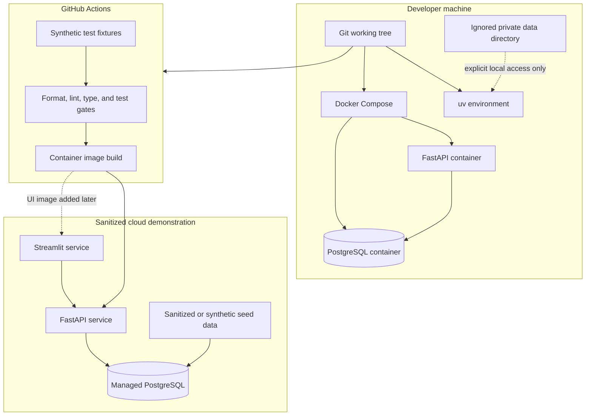

# Deployment Strategy

## Status

- Document status: Baseline for Milestone 1A
- Last reviewed: 2026-08-23
- Applies to: Local development, CI, and the sanitized cloud demonstration
- Deployment maturity: Public demonstration with documented production-hardening requirements

## Purpose

This document defines how RunCoach AI will be executed reproducibly on a developer machine,
validated in continuous integration, and deployed as a sanitized cloud demonstration.

The deployment strategy supports these project objectives:

- Reproduce the application from version-controlled source and locked dependencies.
- Keep private activity data and credentials outside Git and public cloud environments.
- Demonstrate containerization, environment-specific configuration, health checks, database
  migrations, CI/CD, and cloud-computing principles.
- Keep deployment complexity proportional to verified requirements and operational needs.
- Produce evidence that can be included in the graduation report and presentation.

The cloud deployment is a demonstration environment, not a medical system, a production
coaching service, or a public repository of the athlete's personal data.

## Deployment principles

1. Build the same application artifact for each environment.
2. Supply environment-specific values through environment variables.
3. Never bake credentials or private activity data into a container image.
4. Use PostgreSQL as the durable system of record.
5. Apply database schema changes through Alembic migrations.
6. Expose liveness and readiness health checks.
7. Run automated quality gates before deployment.
8. Use sanitized or synthetic data in any publicly reachable environment.
9. Keep the initial cloud architecture small and replaceable.
10. Record the exact deployed revision and configuration assumptions.

## Environment model

| Environment | Purpose | Data policy | Infrastructure |
| --- | --- | --- | --- |
| Local host | Fast development and test execution | Private files allowed only in ignored directories | Python, `uv`, local virtual environment |
| Local Compose | Reproducible integration environment | Private files allowed only through explicit local mounts | API container and PostgreSQL container |
| CI | Automated verification | Synthetic fixtures only | Ephemeral GitHub Actions runner |
| Cloud demo | Public evaluation and portfolio demonstration | Sanitized or synthetic data only | Container platform and managed PostgreSQL |
| Production | Future operational deployment | Requires an explicit privacy and consent policy | Hardened managed infrastructure |

Private Garmin and Strava exports must remain on the local machine. They must not be copied
to CI, included in Docker build contexts, committed to Git, or uploaded to the public cloud
demonstration.

## Deployment topology



The current Milestone 1A Compose topology contains the API and PostgreSQL only. The
Streamlit service will be added when the user interface exists.

## Runtime components

| Component | Local runtime | Cloud runtime | Responsibility |
| --- | --- | --- | --- |
| FastAPI application | Host process or Compose service | Container service | REST API and health endpoints |
| PostgreSQL | Compose service | Managed database | Durable application data |
| Alembic | Host command or one-off container command | Release command | Database schema migrations |
| Streamlit | Enabled when the UI module is available | Separate container service | MVP user interface |
| Import processing | Initially in the modular monolith | Same application boundary | Validate and normalize uploaded exports |
| LangGraph workflow | Enabled after deterministic analytics contracts are available | Optional in demo mode | Controlled recommendation workflow |
| LLM provider | Disabled by default | Disabled unless explicitly configured | Explanation generation only |

Kafka, Kubernetes, a service mesh, and multiple independently deployed domain
microservices remain supported evolution options. Their adoption requires a
demonstrated scale or isolation requirement.

## Local prerequisites

The supported local development environment is Windows with PowerShell.

Required software:

- Git
- Python 3.12.10
- `uv` 0.10.10 or a compatible verified version
- Docker Desktop
- Docker Compose v2

The repository pins Python in `.python-version` and locks Python dependencies in `uv.lock`.

## First-time local setup

Run these commands from `C:\Users\saade\runcoach-ai`:

```powershell
Copy-Item -LiteralPath '.env.example' -Destination '.env'
uv sync --locked --all-groups
docker compose config --quiet
docker compose up --build -d
docker compose ps
Invoke-RestMethod 'http://localhost:8000/health/ready' | ConvertTo-Json
```

The `.env` file is local configuration and is ignored by Git. Values in `.env.example` are
development placeholders, not production credentials.

## Local quality checks

Before committing a logical checkpoint, run:

```powershell
uv run ruff format --check .
uv run ruff check .
uv run mypy src tests
uv run pytest --cov=runcoach --cov-report=term-missing
docker compose config --quiet
```

A developer may run `uv run ruff format .` before the checks when formatting changes are
expected.

## Local service lifecycle

Start the full local environment:

```powershell
docker compose up --build -d
```

Inspect service state:

```powershell
docker compose ps
```

Inspect API logs:

```powershell
docker compose logs api
```

Inspect database logs:

```powershell
docker compose logs db
```

Stop containers while preserving the named PostgreSQL volume:

```powershell
docker compose down
```

Removing the database volume is destructive and is not part of the normal workflow. It must
only be done intentionally after confirming that no required local data remains.

## Health checks

The API exposes two health concepts:

| Endpoint | Meaning | Database required |
| --- | --- | --- |
| `/health/live` | The application process can answer HTTP requests | No |
| `/health/ready` | The application and required database dependency are ready | Yes |

A container orchestrator or cloud platform should use liveness to detect a failed process
and readiness to decide whether the application can receive traffic.

A readiness failure must not reveal connection strings, passwords, SQL statements, or
internal exception details.

## Configuration

Application settings use the `RUNCOACH_` prefix.

| Variable | Purpose | Secret | Default policy |
| --- | --- | --- | --- |
| `RUNCOACH_ENVIRONMENT` | Identifies the runtime environment | No | Explicit per environment |
| `RUNCOACH_LOG_LEVEL` | Controls application log verbosity | No | `INFO` |
| `RUNCOACH_API_HOST` | API bind address | No | `0.0.0.0` in containers |
| `RUNCOACH_API_PORT` | API port | No | `8000` |
| `RUNCOACH_DATABASE_URL` | PostgreSQL connection URL | Yes in shared environments | Inject at runtime |
| `RUNCOACH_PRIVATE_DATA_DIR` | Local private-file location | No | Local use only |
| `RUNCOACH_LLM_PROVIDER` | Enables or disables an LLM provider | No | `disabled` |
| `RUNCOACH_OPENAI_MODEL` | Configured model identifier | No | Empty while disabled |
| `OPENAI_API_KEY` | External provider credential | Yes | Never committed |
| `POSTGRES_DB` | Local Compose database name | No | Development only |
| `POSTGRES_USER` | Local Compose database user | No | Development only |
| `POSTGRES_PASSWORD` | Local Compose database password | Yes | Development placeholder only |

Cloud secrets must be stored in the selected platform's secret-management facility. They
must not appear in source files, Dockerfiles, Compose files, CI logs, screenshots, report
appendices, or presentation slides.

## Container image policy

The application image must:

- Use a pinned Python base-image version.
- Install dependencies from `uv.lock`.
- Exclude development dependencies from the runtime image.
- Run as a non-root user.
- Copy application source only after dependency installation layers where practical.
- Exclude `.env`, Git metadata, private exports, test caches, and local databases.
- Expose only the application port required by the platform.
- Start the API with an explicit command.
- Be rebuildable from a clean clone.

The image must not contain Garmin exports, Strava exports, GPS tracks, database dumps,
credentials, local logs, ML experiment artifacts, or report drafts containing private data.

For the cloud demonstration, the deployed image should be associated with an immutable Git
commit identifier. A version tag may be added in addition to `latest`; deployment must not
rely on `latest` alone when reproducibility evidence is collected.

## Database migrations

Alembic is the only supported mechanism for changing the PostgreSQL schema.

Inspect the current migration state:

```powershell
uv run alembic current
uv run alembic heads
```

Apply committed migrations from the Windows host:

```powershell
uv run alembic upgrade head
```

Apply migrations through a one-off Compose container:

```powershell
docker compose run --rm api uv run alembic upgrade head
```

Migration rules:

- Every schema change must have a reviewed Alembic revision.
- Application startup must not silently create or alter domain tables.
- Migrations must be tested against a disposable database before cloud deployment.
- Destructive migrations require an explicit data-migration and rollback plan.
- A migration must not be edited after it has been applied to a shared environment.
- Schema state must be recorded as part of deployment evidence.

The first domain migration will be created only after the initial data model is reviewed and
representative export structures have been inspected.

## Continuous integration

The current GitHub Actions workflow performs:

1. Repository checkout.
2. Installation of the pinned `uv` version.
3. Installation of Python 3.12.10.
4. Locked dependency synchronization.
5. Formatting verification.
6. Ruff linting.
7. Strict mypy type checking.
8. Pytest execution with the configured coverage threshold.
9. Docker Compose configuration validation.
10. API container-image build.

CI uses only repository source and synthetic test fixtures. It must never require the
developer's `.env`, personal export files, private PostgreSQL volume, or LLM credentials.

A failing quality gate blocks the release candidate. Deployment automation will be added
only after the cloud platform is selected and the manual deployment is understood.

## Cloud demonstration data policy

The public or remotely accessible demonstration must run in a dedicated demo mode.

Demo mode must enforce these rules:

- Use only synthetic or explicitly sanitized activity records.
- Do not copy the local development database.
- Do not upload raw Garmin or Strava exports.
- Remove athlete names, usernames, email addresses, device serial numbers, and account IDs.
- Remove or transform GPS coordinates so routes and home locations cannot be reconstructed.
- Replace source activity identifiers with generated demonstration identifiers.
- Remove free-text fields that may contain personal information.
- Use shifted or synthetic timestamps if dates reveal private routines.
- Verify that screenshots and logs contain no private information.
- Keep file import disabled in a public demo unless secure access controls are implemented.
- Keep LLM access disabled unless a bounded demonstration requires it.

A sanitized record must retain only the minimum fields needed to demonstrate analytics,
such as sport type, duration, distance, elevation, aggregate heart rate, aggregate cadence,
derived metrics, and non-identifying temporal order.

Sanitization must be reproducible. The project must record:

- The source dataset category without publishing the private source.
- The sanitization script version.
- Fields removed or transformed.
- Validation checks applied after sanitization.
- The number of records produced.
- Known residual privacy risks.
- A manual review decision before upload.

## Cloud platform selection

The exact platform will be selected before the initial cloud release after verifying its current pricing, free-tier
limits, regional availability, PostgreSQL support, sleep behavior, and outbound API policy.

The selection criteria are:

| Criterion | Required outcome |
| --- | --- |
| Container support | Runs the locked application image or an equivalent reproducible build |
| PostgreSQL | Provides a managed instance or a secure compatible service |
| Secrets | Injects credentials without committing them |
| TLS | Provides HTTPS for public traffic |
| Logs | Provides basic runtime and deployment logs |
| Health checks | Supports liveness or readiness monitoring |
| Cost control | Supports a free or explicitly capped deployment budget |
| Reproducibility | Associates deployment with a Git revision |
| Data location | Acceptable for sanitized demonstration data |
| Operational effort | Proportional to verified operational requirements |

Candidate services may include a managed container platform,
or separate managed services for the API, Streamlit UI, and PostgreSQL. Free-tier terms
change over time, so the final choice must be verified rather than assumed in this document.

## Recommended MVP cloud topology

The preferred MVP topology is:

- One containerized FastAPI service.
- One containerized Streamlit service after the UI is implemented.
- One small managed PostgreSQL database.
- Platform-managed HTTPS.
- Platform-managed runtime secrets.
- Sanitized seed data loaded through a controlled command.
- LLM integration disabled by default.
- No public raw-file import endpoint.
- No Kafka cluster.
- No Kubernetes cluster.

Separating the API and Streamlit runtime processes demonstrates service boundaries without
turning the modular monolith into artificial domain microservices. Both processes may be
built from the same repository while using different startup commands.

## Cloud release process

The initial cloud deployment will be manual but documented. Automation may be added after a
successful repeatable release.

Release steps:

1. Confirm that the working tree is clean.
2. Record the Git commit identifier.
3. Run all local quality checks.
4. Confirm the CI workflow passes for the revision.
5. Build the application image from the committed source.
6. Provision or verify the managed PostgreSQL service.
7. Configure runtime environment variables and secrets.
8. Apply Alembic migrations.
9. Load only the approved sanitized demonstration dataset.
10. Deploy the API.
11. Deploy the Streamlit UI when available.
12. Verify liveness, readiness, API behavior, and UI behavior.
13. Review cloud logs for secrets or private data.
14. Record the deployment URL, date, revision, and platform configuration.
15. Capture sanitized evidence for the report and presentation.

Deployment must stop if the dataset has not passed its privacy review.

## CI/CD evolution

The project uses incremental delivery:

| Stage | Adoption condition | Automation |
| --- | --- | --- |
| CI baseline | Every change | Quality checks and image build |
| Manual cloud release | First validated cloud release | Documented platform deployment |
| CD candidate | After the release process is stable | Deploy verified revisions after CI |
| Production pipeline | After production-readiness requirements are approved | Hardened release controls |

A simple deployment hook or platform Git integration is acceptable for the MVP if it
deploys only after CI succeeds. Advanced environment promotion and release controls should be added when availability, compliance, or team-workflow requirements demand them.

## Rollback strategy

Application rollback:

1. Identify the last known healthy Git revision and image.
2. Confirm whether the failed release included a database migration.
3. Redeploy the previous application image when schema compatibility permits.
4. Verify liveness, readiness, and core API behavior.
5. Record the incident and corrective action.

Database rollback requires more caution. Alembic downgrade commands must not be run
automatically against shared data. Prefer a forward corrective migration unless a tested
downgrade and a recent backup are available.

Because the cloud environment contains only sanitized demonstration data, it may be rebuilt
from migrations and the sanitized seed dataset if recovery is simpler and documented.

## Backup and recovery

Local development:

- The named Compose volume preserves PostgreSQL data across ordinary `docker compose down`.
- Private exports remain the authoritative raw source outside the database.
- Important experiment definitions and code are version controlled.
- Local database backups may contain private data and must remain ignored and protected.

Cloud demonstration:

- Use platform backups when included within the selected plan.
- Keep the sanitized seed dataset reproducible.
- Treat rebuilding from migrations and sanitized seed data as the minimum recovery method.
- Never restore a private local database into the public demo environment.

A successful recovery test should recreate the demo schema and data in a disposable
environment.

## Logging and observability

The MVP uses structured application logs written to standard output.

Logs should include:

- Timestamp
- Log level
- Service name
- Environment
- Request or correlation identifier where available
- Event name
- Non-sensitive outcome information
- Duration for selected operations

Logs must not include:

- Passwords or database connection URLs
- API keys or authorization headers
- Raw FIT, GPX, CSV, or TCX contents
- Full GPS coordinates
- Athlete names or account identifiers
- Complete LLM prompts containing personal records
- Stack traces returned to public clients

The MVP does not require a separate observability platform. Platform logs, container health,
request timing, and selected application counters are sufficient for the academic
demonstration.

## Security controls

Minimum deployment controls:

- HTTPS for any publicly reachable service.
- Runtime secrets stored outside Git.
- Non-root application containers.
- Restricted database network access.
- Separate credentials for local and cloud databases.
- Dependency versions locked in `uv.lock`.
- Synthetic fixtures in CI.
- Sanitized data in the cloud.
- No public administrative database port.
- No public raw activity upload in demo mode.
- No LLM credential unless the feature is explicitly demonstrated.
- Generic client-facing error messages with detailed server-side logging.

Authentication is not required for a read-only sanitized demonstration if all mutation and
upload functionality is disabled. If private features are exposed remotely, authentication
becomes mandatory and must be added before deployment.

## Cost controls

The initial target is a free deployment. Free-tier availability is not assumed until it is
verified before platform selection.

Cost mitigations include:

- Use the smallest suitable service sizes.
- Allow demo services to sleep when acceptable.
- Disable unused environments.
- Avoid Kafka, Kubernetes, GPU instances, and managed ML platforms.
- Disable LLM calls by default.
- Set provider usage limits before enabling an external model.
- Remove test deployments after evidence is captured.
- Record and approve any unavoidable operational cost before purchase.

A small paid budget requires explicit reconsideration and approval.

## Deployment verification checklist

A cloud release is accepted only when:

- CI passes for the deployed Git revision.
- The container starts without root privileges.
- Alembic reports the expected schema revision.
- `/health/live` reports success.
- `/health/ready` confirms database connectivity.
- The API serves expected sanitized data.
- The Streamlit UI can reach the API when the UI is included.
- No private file or secret exists in the image.
- No private activity record exists in the cloud database.
- Logs contain no credentials or raw personal data.
- HTTPS is active.
- A restart preserves the managed database state.
- Deployment steps are reproducible from documentation.
- The deployed revision, date, URL, and limitations are recorded.

## Deployment evidence for the graduation report

Retain sanitized evidence of:

- CI quality-gate results.
- Container build completion.
- Docker Compose service health.
- Alembic migration state.
- Cloud service topology.
- Cloud health-check responses.
- Sanitized dashboard screenshots.
- Deployment revision and timestamp.
- Recovery or rebuild test.
- Cost and free-tier limitations.
- Security and privacy checks.

Do not include secret values, private URLs containing tokens, personal GPS maps, raw export
filenames, or identifying cloud-database connection details.

## Academic concept mapping

| Deployment decision | Academic concept | Problem solved | Simpler alternative | Limitation |
| --- | --- | --- | --- | --- |
| Docker image | Containerization and reproducibility | Reduces environment drift | Run directly from Python | Does not eliminate platform differences |
| Docker Compose | Multi-container orchestration | Reproduces API and database integration | Start processes manually | Not a production orchestrator |
| Managed PostgreSQL | Cloud-managed persistence | Avoids operating a database server | Local database only | Cost and provider limits |
| Environment variables | Externalized configuration | Separates configuration from code | Hard-coded values | Secret storage still depends on platform |
| Alembic | Schema evolution | Makes database changes traceable | Manual SQL | Requires migration discipline |
| Health endpoints | Reliability engineering | Distinguishes process health from dependency readiness | Check only the port | Does not provide full observability |
| GitHub Actions | Continuous integration | Applies repeatable quality gates | Manual checks | Hosted runner differs from local Windows |
| Immutable revision record | Release traceability | Links evidence to exact source | Deploy uncommitted source | Requires consistent tagging |
| Sanitized demo data | Privacy-aware cloud design | Prevents exposure of personal activities | No cloud demo | Sanitization may reduce realism |
| Modular monolith deployment | Architecture proportionality | Limits operational overhead | One unstructured process | Less independent scaling |

This demonstrates cloud and DevOps principles at the scale supported by measured requirements. It does not claim
high availability, global distribution, autoscaling under substantial demand, or genuine
Big Data infrastructure.

## Known limitations

- The initial deployment may sleep or have limited resources under a free plan.
- Cloud-platform availability and pricing may change after this document is reviewed.
- The MVP has no multi-region failover.
- The MVP has no formal service-level objective.
- The MVP has no dedicated secrets vault beyond the selected platform's facility.
- The MVP has no production-grade centralized observability stack.
- The public demo will not prove private-file ingestion because uploads remain local.
- Managed PostgreSQL resource limits may constrain trackpoint-scale demonstration data.
- The deployment will be evaluated for reproducibility, not production certification.

## Future deployment options

If the project continues after graduation, justified improvements may include:

- Authenticated private deployments.
- Object storage for encrypted raw files.
- Background workers for large imports.
- A job queue after measured concurrency requires it.
- Automated preview environments.
- Infrastructure as code.
- Centralized metrics and tracing.
- Encrypted backups with tested restore procedures.
- Horizontal API scaling.
- Kubernetes only if operational or scaling requirements justify it.

These are future options, not hidden MVP commitments.