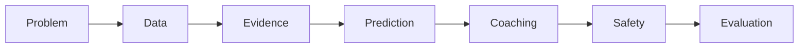

# Presentation Outline

## Status

- Document type: Living defense and demonstration outline
- Initial version: 2026-08-23
- Audience: Graduation jury, technical reviewers, and project stakeholders
- Presentation goal: Demonstrate a coherent, evidence-backed product and defend its decisions

## Core message

PaceCraft AI transforms fragmented personal running exports into traceable training evidence,
validated predictions, and controlled coaching recommendations while preserving deterministic
calculation, privacy, and scientific honesty.

The presentation should tell one connected story:

## Presentation principles

- Lead with the athlete problem and product value.
- Show architecture only after the need for it is clear.
- Demonstrate one end-to-end evidence path.
- Separate implemented results from planned evolution.
- Show measured results with baselines and limitations.
- Explain why each major technology exists.
- Keep private data out of slides, screenshots, logs, and the live demo.
- Treat warning indicators as non-medical.
- Prepare a deterministic fallback for every network-dependent demonstration.

## Slide sequence

### Slide 1: Title and product statement

**Title:** PaceCraft AI

**Subtitle:** Privacy-aware running analytics, performance prediction, and evidence-grounded coaching

Show:

- Project name.
- One-sentence product statement.
- Presenter and program information.
- A sanitized dashboard or system visual.

Speaker point:

The project is an integrated data and decision-support platform, not a dashboard with an LLM added
to it.

### Slide 2: The problem

Show:

- Longer historical coverage in Strava.
- Richer Garmin sensor coverage beginning in April 2026.
- Inconsistent formats, fields, identifiers, and sampling.
- The gap between platform summaries and evidence-backed coaching.

Speaker point:

The central problem is trustworthy integration and interpretation across a changing longitudinal
record.

### Slide 3: Goals and success criteria

Show:

- Import real exported activities.
- Preserve quality and provenance.
- Calculate deterministic training indicators.
- Evaluate readiness and performance.
- Test an eligible ML problem against baselines.
- Generate traceable, safety-reviewed recommendations.
- Run reproducibly locally and in a sanitized cloud environment.

State the primary race context:

- Casablanca Half Marathon, 2026-10-25, initially targeting sub-1:30.
- Marrakech Marathon, 2027-01-31.

### Slide 4: Research question and contributions

Show the main research question in one sentence.

Group contributions into:

- Data engineering.
- Deterministic analytics.
- Machine-learning evaluation.
- Controlled AI workflow.
- Cloud and software quality.

Speaker point:

The contribution is the traceable system that connects these layers, not the number of technologies
used.

### Slide 5: System context

Show:

- Athlete.
- Garmin and Strava exports.
- PaceCraft AI.
- PostgreSQL.
- Optional LLM provider.
- Sanitized cloud demonstration.

Emphasize boundaries:

- Exports are the core ingestion path.
- Direct Garmin API access is not required for operation.
- Raw private files never enter the public demonstration.

### Slide 6: Architecture

Show the modular-monolith container and module diagram.

Explain:

- FastAPI service boundary.
- PostgreSQL system of record.
- Import, analytics, ML, coaching, and API modules.
- Streamlit as an API client.
- Alembic migrations.
- Separate runtime processes only where operationally useful.

Defense point:

The architecture preserves module boundaries and evolution paths without inventing distributed
failure modes that current requirements do not need.

### Slide 7: Technology decisions

Use a compact table:

| Component | Requirement served | Main limitation |
| --- | --- | --- |
| Python and `uv` | Reproducible analytics and application environment | Python processes require care for CPU-heavy work |
| FastAPI | Typed REST contracts | Adds a service boundary |
| PostgreSQL | Integrity, provenance, longitudinal queries | Requires managed operation or a container |
| Pandas and NumPy | Batch transformation and analytics | Memory-bound |
| scikit-learn | Transparent baseline-oriented ML | Model validity depends on labels |
| LangGraph | Explicit coaching state and safety routing | Must add value beyond ordinary functions |
| Docker and CI | Reproducibility and automated verification | Do not prove production reliability alone |

Mention measurable adoption triggers for Kafka, Kubernetes, specialized NoSQL stores, RAG, or
independent services if asked.

### Slide 8: Ingestion and provenance

Show the end-to-end import sequence:

1. Discover export file.
2. Hash and classify source.
3. Parse through a format adapter.
4. Validate structure, units, ranges, and timestamps.
5. Normalize into canonical records.
6. Find duplicate candidates.
7. Commit transactionally.
8. Persist quality findings and provenance.

Evidence to display:

- Sanitized source-format matrix.
- Import counts.
- An example provenance chain.
- Idempotent re-import result.

### Slide 9: Data model

Show a simplified entity-relationship diagram grouped into:

- Athlete and goals.
- Import and source provenance.
- Canonical activities, laps, and trackpoints.
- Derived metrics and readiness.
- Experiments and predictions.
- Coaching runs and recommendations.

Speaker point:

`athlete_id` is retained throughout even though the evaluated release supports one athlete.

### Slide 10: Deterministic analytics

Show calculated evidence such as:

- Weekly distance, duration, and elevation.
- Pace and heart-rate trends.
- Intensity distribution.
- Acute and chronic load.
- Fitness, fatigue, and form indicators.
- Personal-best progression.
- Riegel predictions.

For one metric, show its inputs, formula or algorithm, method version, missing-data rule, and test.

Speaker point:

These values are calculated by code. The language model does not invent or recompute them.

### Slide 11: Race readiness

Show a readiness snapshot for 5K, 10K, half marathon, or marathon.

Include:

- Goal and target demand.
- Component evidence.
- Data coverage.
- Warning indicators.
- Confidence or limitation statement.
- Difference between readiness support and outcome guarantee.

Use the Casablanca half-marathon goal as the primary example when the data supports it.

### Slide 12: ML question and scientific guardrails

Show:

- Why the race-label audit comes first.
- Provisional race-time residual target.
- Candidate feature families.
- Forbidden leakage examples.
- Walk-forward chronological evaluation.
- Riegel and simple historical baselines.
- Eligibility decision.

Speaker point:

An insufficient dataset or a model that does not beat the baseline is a valid result, not something
to conceal.

### Slide 13: ML results

Populate only after experiments are complete.

Recommended visuals:

- Chronological train-test diagram.
- Label count and distance distribution.
- Baseline-versus-model metric table.
- Predicted-versus-observed plot.
- Residuals over time.
- Explicit eligibility conclusion.

If the model is rejected, present:

- Which gate failed.
- Why the deterministic baseline remains valid.
- What additional evidence would enable reevaluation.

### Slide 14: Controlled coaching workflow

Show the five responsibilities:

1. Data-quality agent.
2. Training-load analyst.
3. Performance-prediction agent.
4. Coaching agent.
5. Safety and consistency reviewer.

Use color or notation to distinguish deterministic nodes from optional LLM interpretation.

Speaker point:

The graph exists to enforce evidence contracts, routing, fallback, and review. It is not a set of
personas chatting with one another.

### Slide 15: Recommendation explainability and safety

Show one sanitized recommendation with:

- Recommendation action.
- Evidence identifiers.
- Calculated values.
- Reasoning summary.
- Confidence and limitations.
- Non-medical warning language.
- Reviewer decision.

Also show one blocked or downgraded recommendation to demonstrate safe failure.

### Slide 16: Verification and reproducibility

Show:

- Unit, parser, database, API, ML, agent, and end-to-end test layers.
- Formatting, linting, strict typing, coverage, and build gates.
- Clean dependency lock.
- Database migrations.
- Healthy Docker Compose services.
- CI result tied to a Git revision.

Avoid presenting coverage percentage as proof of scientific validity.

### Slide 17: Privacy-aware cloud deployment

Show local and cloud deployment boundaries.

Emphasize:

- Raw files and credentials remain local and outside Git.
- CI uses synthetic fixtures.
- Cloud uses sanitized or synthetic data.
- GPS and identifying metadata are removed or transformed.
- Runtime secrets are injected by the platform.
- LLM access is disabled by default.

Include cloud health-check and sanitized UI evidence.

### Slide 18: Results, limitations, and conclusion

Summarize measured outcomes across:

- Data ingestion and quality.
- Deterministic analytics.
- Prediction eligibility and error.
- Coaching safety and traceability.
- Reproducibility and deployment.

State major limitations:

- Single-athlete evidence.
- Uneven historical sensor coverage.
- Audited label volume.
- Estimated physiological parameters.
- Unknown race-day factors.

End by answering the research question directly.

## Live demonstration sequence

Use only sanitized or synthetic data on the presentation machine.

### Demonstration path

1. Show the athlete profile and target race.
2. Show an already imported sanitized activity inventory.
3. Open one activity and its provenance and quality findings.
4. Show weekly volume and intensity trends.
5. Show fitness, fatigue, form, and readiness components.
6. Show a Riegel prediction and, if eligible, the ML comparison.
7. Generate or retrieve a coaching run.
8. Open the recommendation evidence and safety-review result.
9. Show liveness, readiness, and deployed revision.

The demo should prove traceability from an output back to source and method, not simply move through
screens.

## Demonstration fallback

Prepare for network or provider failure:

- Run the complete application locally with Docker Compose.
- Keep an approved sanitized database seed.
- Keep the LLM provider disabled or provide a recorded schema-valid response.
- Retain sanitized screenshots of every critical step.
- Retain captured CI and cloud health evidence.
- Verify that deterministic analytics and recommendations remain viewable without external calls.

Do not improvise with private exports if the cloud or network fails.

## Architecture defense notes

### Why a modular monolith?

- The domain benefits from strong internal boundaries.
- Ingestion, analytics, and coaching share transactions and versioned contracts.
- Current scaling and ownership requirements do not require independent deployments.
- Modules have documented extraction triggers if those requirements change.

### Why PostgreSQL?

- Activities, laps, metrics, experiments, and coaching evidence are relational.
- Constraints and transactions protect integrity.
- JSONB accommodates bounded source-specific metadata.
- Provenance and longitudinal queries benefit from one durable system of record.

### Why FastAPI plus Streamlit?

- FastAPI creates a typed, testable service contract.
- Streamlit provides an efficient analytical interface.
- The UI does not bypass domain and persistence boundaries.
- A custom web or mobile client can later consume the same API.

### Why LangGraph?

- The workflow has explicit gates, conditional paths, persistence, and safety review.
- Deterministic and generative responsibilities are visible.
- Provider failure has a defined fallback.
- Ordinary functions remain appropriate inside deterministic nodes.

### Why not claim Big Data scale?

- The observed case is one athlete.
- The contribution is the application of sound data-engineering principles.
- Distributed technologies have adoption triggers tied to measured volume, velocity, availability,
  and isolation requirements.

## Expected questions and concise answers

### Is the dataset large enough for machine learning?

That is an evaluated question, not an assumption. The label audit determines eligibility. The
system retains Riegel and simple historical baselines when the learned model lacks evidence.

### Why use an LLM if calculations are deterministic?

The LLM converts structured evidence into contextual language. It is constrained by typed inputs,
evidence references, numeric checks, safety review, and fallback behavior.

### Are fitness and fatigue directly measured?

No. They are versioned modeled indicators whose definitions, parameters, and limitations are shown.

### Does the system predict injury?

No. It detects non-medical warning patterns and recommends caution or review without diagnosis.

### Why support `athlete_id` for one athlete?

It prevents the schema from embedding a personal singleton assumption and enables later extension.
It does not imply that current results generalize to multiple athletes.

### Why not use every technology in the degree program?

Each component must solve a measured requirement. The design documents adoption triggers for
distributed streaming, orchestration, specialized storage, retrieval, and independent services so
the architecture can evolve when evidence supports them.

### How is private data protected?

Raw exports are ignored by Git, stored locally, excluded from container build contexts and CI, and
never copied into the public cloud. Demonstration data passes automated and manual sanitization.

### What happens if the model performs worse than Riegel?

The negative result is recorded, the learned model remains ineligible for coaching, and the
deterministic baseline stays operational.

### What is the main scientific limitation?

The evidence comes from one athlete with uneven historical coverage and potentially few verified
performance labels. Conclusions are personalized and bounded accordingly.

## Evidence checklist

Before finalizing slides, confirm that every visible result has:

- A source revision.
- A dataset or fixture identifier.
- A method version.
- A unit.
- An evaluation protocol where applicable.
- A limitation statement.
- Sanitization approval.

## Visual checklist

- Use the same terminology as the application and report.
- Keep diagrams readable without zooming.
- Prefer one claim per chart.
- Label axes and units.
- Show chronological order for time-series results.
- Distinguish observed, derived, predicted, and generated information.
- Remove private coordinates, filenames, identifiers, and credentials.
- Avoid screenshots containing terminal secrets or browser tokens.

## Final rehearsal checklist

- The deployed and local revisions match the stated evidence.
- The demo dataset is approved for presentation.
- Docker Compose starts from a clean state.
- Liveness and readiness checks pass.
- The deterministic fallback works without network access.
- The ML slide reflects the actual eligibility decision.
- Recommendations show evidence and safety review.
- The conclusion answers the research question.
- No slide overstates generalization, medical meaning, or scale.
