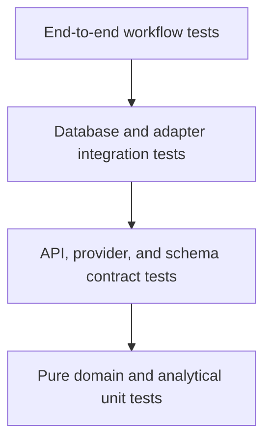

# Testing Strategy

## Status

- Project: PaceCraft AI
- Document state: Initial approved baseline
- Last updated: 2026-08-23
- Test runner: Pytest
- Initial statement-coverage gate: 80 percent

## Objectives

Testing must provide evidence that:

- Private export data is handled safely.
- Imports are validated, repeatable, and idempotent.
- Deterministic metrics produce known results.
- Database constraints preserve important invariants.
- Temporal ML evaluation does not use future information.
- LLM output cannot bypass evidence or safety rules.
- Local and containerized execution are reproducible.
- Documentation and implementation describe the same behavior.

Coverage percentage is a quality signal, not proof of correctness.

## Test levels



Most tests should be fast unit and contract tests. A smaller number of PostgreSQL and
end-to-end tests validate integration boundaries.

## Test environments

### Local unit environment

- Windows host.
- Python 3.12.10 managed by `uv`.
- No network or Docker required for pure tests.
- LLM provider disabled or replaced with a fake.

### Local integration environment

- Docker Compose PostgreSQL.
- Application code may run on the host or in the API container.
- Private test input is synthetic or sanitized.

### CI environment

- GitHub-hosted Linux runner.
- Locked Python dependencies.
- Formatting, linting, type checking, tests, coverage, Compose validation, and image build.
- No private data or provider credentials.
- Network-backed LLM tests disabled.

### Cloud smoke environment

- Sanitized demonstration deployment.
- Health, migration, and representative read-only flow checks.
- No destructive test against irreplaceable data.

## Test-data policy

Allowed fixtures:

- Fully synthetic activity files.
- Small manually constructed records.
- Sanitized samples with identifying fields and coordinates removed or transformed.
- Deliberately malformed files created for test cases.

Forbidden fixtures:

- Raw Garmin or Strava exports.
- Real account identifiers.
- API credentials.
- Exact home or frequently visited coordinates.
- Private database dumps.
- Files whose license or sharing permission is unclear.

Every sanitized fixture requires a short provenance note explaining:

- Original format category.
- Sanitization method.
- Fields removed or changed.
- Why re-identification risk is acceptably low.
- Which parser behavior the fixture represents.

## Test organization

The target structure is:

```text
tests/
  unit/
    analytics/
    quality/
    performance/
    ml/
    coaching/
  api/
  integration/
    db/
    ingestion/
  contract/
  e2e/
  fixtures/
    synthetic/
    sanitized/
```

Tests should be named by behavior rather than implementation detail.

## Unit tests

### Configuration

Test:

- Default settings.
- Environment-variable overrides.
- Port-range validation.
- Provider-disabled defaults.
- Secret values are represented as secrets rather than logged text.

### Domain models

Test:

- Valid and invalid states.
- Time-valid physiology periods.
- Goal distance and target-time rules.
- Canonical unit conversions.
- Timestamp and timezone behavior.

### Data quality

Test:

- Missing required fields.
- Implausible distance, duration, heart rate, and timestamps.
- Sensor-coverage calculations.
- Severity assignment.
- Blocking versus warning outcomes.
- Stable issue codes.

### Deduplication

Test:

- Exact file hashes.
- Provider identifiers.
- Same-source repeated imports.
- Garmin and Strava duplicate candidates.
- Near-time but genuinely separate activities.
- Ambiguous candidates routed to review.
- Stable fingerprint generation.
- Idempotency across retries.

### Deterministic analytics

Test with known values and explicit tolerances:

- Distance, duration, speed, and pace conversions.
- Weekly aggregation in athlete timezone.
- Zone-boundary behavior.
- Heart-rate coverage.
- Training-load calculations.
- Acute and chronic decay calculations.
- Fitness, fatigue, and form indices.
- Missing-day behavior.
- Personal-best comparison.
- Riegel predictions.
- Readiness component and confidence rules.

Floating-point assertions use documented absolute or relative tolerances.

### Error conditions

Test:

- Zero distance.
- Zero or negative duration.
- Missing physiology inputs.
- Empty activity history.
- Partial sensor streams.
- Long gaps in training.
- Changes in physiology configuration.

## Parser and ingestion tests

Each inspected adapter requires:

- One minimal valid fixture.
- One representative valid fixture.
- Missing optional fields.
- Invalid required fields.
- Truncated or corrupt content.
- Unsupported schema or version.
- Repeated import.
- Batch containing valid and invalid files.
- Parser-version provenance.

Adapter tests verify normalized domain records, not every internal parsing step.

### Golden files

Small normalized outputs may be stored as reviewed JSON golden files when they improve
clarity. Golden files must:

- Be synthetic or sanitized.
- Have a schema version.
- Avoid large sensor dumps.
- Be reviewed when intentionally updated.

## Database tests

Identity persistence tests verify one account per athlete, unique normalized login identifiers,
non-recoverable session-token storage, mandatory onboarding evidence, and append-only research
consent. Existing-athlete bootstrap tests assert that credentials are attached without replacing
the athlete, activities, active goal, or active training plan and that repeat execution is
idempotent only for matching credentials.

Authentication tests verify normalized credential login, salted password verification, opaque
token issuance, hash-only session persistence, expiry, last-seen updates, revocation, sanitized
failures, and session-derived athlete context. API tests require bearer authentication for private
analytics and coaching routes. Dashboard tests verify the login gate, athlete-name display, bearer
transport, and in-memory sign-out behavior.

Use PostgreSQL rather than SQLite for integration behavior.

Test:

- Alembic upgrade from an empty database.
- Current schema revision.
- Relevant downgrade where safe.
- Foreign-key enforcement.
- Unique constraints.
- Transaction rollback on import failure.
- Concurrent import-job leasing.
- Idempotent source insertion.
- Canonical and provenance relationships.
- Ordered lap and trackpoint persistence.
- Query indexes for important access paths.

Database tests must isolate their data through transaction rollback, schema recreation, or
dedicated temporary databases.

## API tests

Test:

- Liveness without a database query.
- Readiness success and database-unavailable response.
- Request and response schemas.
- Stable status codes and error codes.
- Invalid identifiers.
- Pagination and filtering.
- Unsupported file types.
- Upload-size boundaries.
- Import-job status.
- No stack traces or private paths in responses.
- OpenAPI generation.

The current Milestone 1A test verifies `/health/live`. Database readiness has also been
verified manually through Docker Compose and will receive an automated integration test.

## Streamlit tests

The MVP emphasizes service and domain tests. UI tests cover:

- Page startup.
- API client error handling.
- Empty states.
- Key dashboard transformation functions.
- Evidence and limitation display.
- No duplicated analytical formulas.

Browser-level automation is optional unless critical flows cannot be validated otherwise.

## Machine-learning tests

### Dataset construction

Test:

- Feature cutoff is earlier than the target event.
- Target activity is absent from its own historical features.
- Duplicate activities share one group.
- Excluded labels do not enter the target.
- Feature and label versions are recorded.
- Manifest hashes are stable.

### Temporal splitting

Test:

- Training timestamps precede validation timestamps.
- Activity groups never cross folds.
- Overlapping windows are purged when configured.
- Preprocessing fits only on the training fold.
- The final test set remains untouched during selection.

### Baselines and metrics

Test:

- Riegel formula with known examples.
- Recent-performance baseline selection.
- MAE, RMSE, MAPE, signed error, and per-distance aggregation.
- Baseline-relative improvement calculation.
- Small or empty evaluation sets fail clearly.

### Model pipeline

Test:

- Missing-value handling.
- Deterministic output for fixed seeds.
- Serialized artifact checksum.
- Feature-order stability.
- Unsupported feature ranges reduce eligibility.
- Ineligible models cannot influence coaching.

No assertion should require an experimental model to beat the baseline on fabricated data.

## Agent-workflow tests

Use a deterministic fake provider.

Test:

- Usable data reaches analysis.
- Blocking data returns limitations.
- Degraded data preserves warnings.
- Ineligible ML falls back to Riegel.
- Every coaching claim references allowed evidence.
- Unknown evidence references are rejected.
- Medical diagnosis language is rejected.
- Confidence and certainty are consistent.
- One revision is allowed.
- A second unsafe draft produces deterministic fallback.
- Provider timeout produces fallback.
- Provider-disabled execution remains useful.
- Graph state and step audit records are persisted.
- Raw questions and browser conversation history are absent from persisted minimized state.
- A coaching answer is not returned as successful when its audit transaction fails.

Network-backed provider tests require an explicit marker and are excluded from normal CI.

## Contract tests

### Parser contracts

All adapters produce the same normalized source-record interface.

### LLM provider contracts

Disabled, fake, and external providers return the same validated output type or a defined
provider error.

### Repository contracts

In-memory fakes and PostgreSQL implementations preserve the same application-level behavior
where a fake is used.

### API contracts

Response models and stable error codes are tested independently of UI rendering.

## End-to-end scenarios

The minimum end-to-end suite eventually covers:

1. Create athlete and physiology profile.
2. Create a race goal.
3. Import a synthetic valid activity.
4. Re-import it and confirm idempotency.
5. Calculate deterministic metrics.
6. Display the activity in a training summary.
7. Calculate a Riegel prediction and readiness snapshot.
8. Run coaching with the fake provider.
9. Persist an approved evidence-backed recommendation.

Additional scenarios:

- Mixed valid and corrupt bulk import.
- Ambiguous cross-source duplicate.
- Missing historical heart rate.
- Insufficient ML data.
- Unsafe generated recommendation.
- Clean database migration and startup.

## Performance checks

The MVP does not need large-scale load testing. Measure representative operations:

- Parse time per file format.
- Bulk-import duration and memory.
- Trackpoint insert throughput.
- Weekly dashboard query latency.
- Metric recalculation duration.
- Coaching-run latency with fake and optional real provider.

Document the dataset size used for every measurement. Do not label a small synthetic benchmark
as Big Data performance.

Initial practical targets may be added after real export volume is known.

## Security checks

Before commits and releases:

- Confirm `.env` and private-data paths are ignored.
- Inspect staged files.
- Search for likely API-key patterns.
- Confirm sanitized fixtures have no identifying coordinates.
- Verify container runs as non-root.
- Check that API errors omit stack traces and private paths.
- Confirm cloud environment variables are stored outside Git.
- Verify raw files are not present in the cloud demonstration image.

A dedicated secret-scanning action may be added after its maintenance and false-positive cost
are evaluated.

## CI quality gates

The initial CI pipeline runs:

```powershell
uv sync --locked --all-groups
uv run ruff format --check .
uv run ruff check .
uv run mypy src tests
uv run pytest --cov=runcoach --cov-report=term-missing
docker compose config --quiet
docker build --tag pacecraft-ai:ci .
```

A change cannot be declared complete while a relevant gate fails.

## Coverage policy

The initial statement-coverage minimum is 80 percent.

Rules:

- Do not exclude difficult domain code merely to raise coverage.
- Branch and behavior quality matter more than one aggregate number.
- Generated migration files may be excluded from application type checking.
- Provider adapters may use contract tests and controlled integration tests.
- Any lowered threshold requires a documented reason and approval.

## Defect workflow

When a test exposes a defect:

1. Preserve the smallest reproducible failing case.
2. Determine whether the defect is in code, fixture, requirement, or test.
3. Add or retain a regression test.
4. Fix the root cause.
5. Run targeted tests.
6. Run the full relevant quality gates.
7. Update documentation if behavior or assumptions changed.

Do not change an expected value solely to make a failing test pass without explaining the
behavioral decision.

## Milestone acceptance

### Foundation acceptance

- Python 3.12.10 and locked dependencies.
- Formatting, linting, and strict type checking pass.
- Liveness test passes.
- Coverage is at least 80 percent.
- Compose configuration validates.
- API image builds.
- API and PostgreSQL become healthy.
- Readiness query succeeds.
- Alembic connects to PostgreSQL.

### Ingestion and persistence acceptance

- Inspected export schemas documented.
- First migration and models tested.
- Representative sanitized fixtures approved.
- Imports are transactional and idempotent.
- Malformed inputs produce structured findings.
- Cross-source duplicate behavior is tested.

### Analytics and dashboard acceptance

- Golden deterministic metric tests pass.
- Missing-data and method-coverage behavior is tested.
- Dashboard summary queries are validated.

### Machine-learning and coaching acceptance

- Label audit completed.
- Temporal leakage tests pass.
- Baselines and candidate model are evaluated.
- Agent graph safety and fallback tests pass.

### Release acceptance

- Clean-clone reproduction.
- End-to-end sanitized flow.
- Green CI.
- Successful cloud smoke test.
- No secrets or raw personal data.
- Documentation and implementation agree.

## Known testing limitations

- Current tests use synthetic behavior and do not yet cover real export variation.
- One athlete cannot validate general coaching effectiveness.
- LLM fakes cannot reproduce all external-provider failure modes.
- The selected cloud platform may behave differently from local Docker.
- Coverage does not measure scientific validity.
